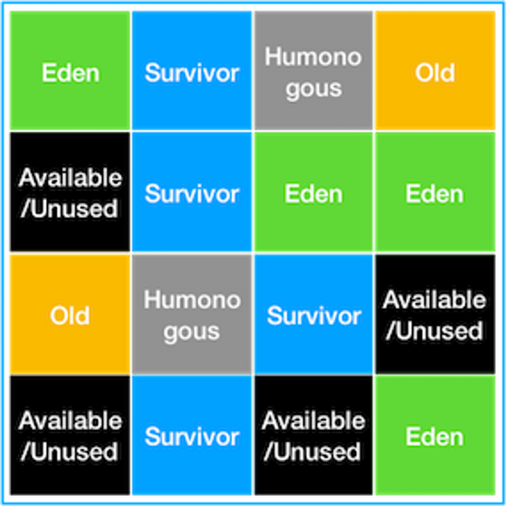

# 📃 Garbage Collector

<h3><strong>💡가비지 컬렉션에 대해 설명해주세요.</strong></h3>

 

GC는 자바의 <strong>`메모리 관리 방법`</strong> 중의 하나로 JVM의 힙 영역에서 동적으로 할당했던 메모리 중
**필요 없게 된 메모리를 주기적으로 해제**하는 기능이다.

### 📌 GC의 장점
- Garbage Collector가 메모리 관리를 대신 해주기 때문에
자바 프로세스가 한정된 메모리를 효율적으로 사용할 수 있어서 개발자는 개발에만 집중할 수 있다.

 

### 📌 GC의 단점

- Garbage Collector가 메모리 관리를 대신 해주기 때문에 개발자는 메모리가 언제 해제되는지 정확히 알 수 없어 제어하기 힘들다.
- GC가 동작하는 동안에는 다른 동작을 멈추기 때문에 오버헤드<strong>(Stop The World)</strong>가 발생한다.

 

<strong>[STW(Stop The World)]</strong>

    GC가 작동하는 동안 GC 관련 스레드를 제외한 모든 스레드가 멈추는 현상
    따라서, 이 시간을 최소화 시키는 것이 쟁점이다.

 

<h3><strong>💡가비지 컬렉션 과정에 대해 설명해주세요.</strong></h3>

### 📌 Minor GC 과정
.png>)
 

Young 영역은 Old 영역에 비해 작기 때문에 메모리의 객체를 찾아 제거하는데 <strong>적은 시간</strong>이 걸린다.

    1️⃣ 처음 생성된 객체는 Young 영역의 일부인 Eden 영역에 위치한다.

    2️⃣ 객체가 계속 생성되어 Eden 영역이 꽉 차게 되면 Minor GC가 실행된다.

    3️⃣  Root Space로부터 그래프 순회를 통해 연결된(Reachable) 객체들을 찾아 마킹한다.

    4️⃣ Eden 영역에서 살아남은 객체는 Survival 0 / 1 영역 중 하나의 영역으로 이동한다.

    5️⃣ Eden 영역에서 Unreachable 객체의 메모리를 해제한다.

    6️⃣ 살아남은 모든 객체들은 age 값이 1씩 증가한다.

    7️⃣ 또다시 Eden 영역에 신규 객체들로 가득 차게 되면 다시 한번  Minor GC 발생하고 Mark한다.

    8️⃣ 살아남은 객체는 Survival 0 / 1 영역 중 비어있는 영역으로 이동하고 Sweep한다.

    9️⃣ 1~ 8까지의 과정을 반복한다.

     

**[GC의 Root Space]**
        
- JVM GC에서의 Root Space는 힙 메모리 영역을 참조하는 <strong>`메서드 영역`</strong>, <strong>`스택 영역`</strong>이다.
-  Root Space로부터 해당 객체에 접근 가능한 지가 해제의 기준이 된다.
  

 

### 📌 Major GC 과정
.png>)
 

Old 영역의 객체들은 Young 영역에서 시작되었으나, GC 과정 중 제거되지 않은 경우 <strong>`age`</strong> 값이 임계값에 도달하게 되어 Old 영역으로 이동한 객체들이다

    1️⃣ Young 영역에 객체의 age가 임계값에 도달하게 되면 이 객체들은 Old 영역으로 이동된다. (Promotion)
    2️⃣ 1번 과정이 반복되어 Old 영역의 메모리가 부족해지면 Major GC가 발생한다.

 

Major GC는 Old 영역에 메모리가 부족해지면 GC를 실행하는 단순한 방식이다.

Old 영역은 상대적으로 큰 공간을 가지고 있어, 이 공간에서 메모리 상의 객체를 제거하는데 많은 시간이 걸린다.  
⇒ <strong> Stop-The-World </strong>

 

<h3><strong>💡 finalize()를 직접 호출하는 것은 왜 문제가 될 수 있을까요?

</strong></h3>

<strong>`finalize()`</strong>는 Object 클래스의 메소드로, 해당 객체의 참조가 없을 때 GC에 의해 자동으로 호출된다.

1. <strong> 실행 시점의 예측 불가능성 </strong>  
    finalize()는 GC가 실행될 때 호출되며, GC의 동작은 JVM의 구현에 따라 다를 수 있다.   
    따라서, finalize()를 직접 호출한다면 언제 호출될지 확실하기 어렵고, 이는 예상치 못한 동작이나 버그를 초래할 수 있다.

2. <strong>가비지 컬렉션 지연</strong>  
    GC는 참조가 없는 객체를 수집하여 자원을 해제하고, 메모리를 회수한다.  
    그러나, finalize()를 오버라이드한 객체는 가비지 수집 즉시 회수되지 않고 종료화 대상으로 먼저 등록되고, 그 결과 finalize() 를 오버라이드 하지 않는 객체보다 수명이 한 사이클 정도 더 길다. 

3. <strong>성능 저하</strong>  
     finalize()는 GC에 의해 호출되며, 이는 일반적으로 비용이 많이 드는 작업이다. finalize() 메서드를 직접 호출한다면 불필요한 가비지 컬렉션 작업이 추가로 발생하고, 이로 인해 성능이 저하될 수 있다.

4. <strong>예외 처리 불가능</strong>  
    finalize() 내부에서 발생한 exception 은 무시되기 때문에, finalize() 메소드 실행 도중 발생한 예외는 아무도 처리할 수 없다.

     

<h3><strong>💡 개발자가 GC 튜닝을 하는 궁극적인 목표는 무엇일까요?
</strong></h3>

    Stop-The-World 시간을 줄이는 것

 

### 📌 G1GC부터는 GC튜닝에 크게 손이 가진 않는데, G1GC는 어떻게 만들었길래 개발자가 튜닝을 이전보다 덜 해도 되는걸까요? 

    기존의 GC 알고리즘에서는 Heap 영역을 물리적으로 고정된 Young / Old 영역으로 나누어 사용하였지만,
    G1GC는 Region이라는 새로운 개념을 새로 도입하여 Heap 영역을 Region이라는 영역으로 체스같이 분할하고, 
    상황에 따라 Eden / Survivor / Old 등 역할을 동적으로 부여하기 때문이다.

 

기존 GC에서는 Young 영역보다 Old 영역의 크기가 크기 때문에 Major GC의 Stop-The-World 시간을 줄이는 것이 GC 튜닝의 관건이었다.  

 

기존 GC에서 튜닝를 위해 사용하는 방법은 다음과 같다.

1. <strong>Old 영역으로 넘어가는 객체의 수 최소화하기</strong>  
    Young 영역의 크기를 잘 조절하여, Old 영역으로 넘어가는 빈도를 줄인다.

2. <strong>Major GC 시간 줄이기</strong>  
    Major GC가 Minor GC 보다 Stop-The-World 시간이 긴 것은 Old 영역이 Youung 영역보다 크기 때문이다. 따라서, Old 영역의 크기를 적절하게 설정하여 Major GC 시간을 줄인다.

    이때, Old 영역의 크기를 막 줄여버리면 자칫 OutOfMemoryError가 발생하거나 Major GC 빈도가 늘어날 수 있다.

 

🔥 이처럼 G1GC 이전의 GC 튜닝의 핵심은 위의 2가지 내용을 고려해 <strong>Young 영역과 Old 영역의 크기</strong>를 적절하게 조절하는 것이었다.

 
 

### 📌 리전으로 구성된 구조가 왜 튜닝의 수고를 덜어주는걸까요?

G1 GC에서는 기존 GC와는 다르게 Heap Memory 전체를 탐색하지 않고,   
<strong>region</strong>별로 탐색하여 메모리가 많이 차있는 <strong>region</strong>을 인식하는 기능을 통해 메모리가 많이 차있는 영역을 우선적으로 GC 한다.

이는 Garbage로 가득찬 영역을 빠르게 회수하여 빈 공간을 확보하므로, 결국 <strong>GC 빈도가 줄어드는 효과</strong>를 가져온다.

또한, 기존 GC에서는 Young 영역에 있는 객체들이 GC가 실행된 후 살아남으면 Eden → Survivor0 → Survivor1으로 순차적으로 이동했지만, G1GC에서는 순차적으로 이동하지는 않는다.

대신 G1 GC는 더욱 효율적이라고 생각하는 위치로 객체를 재할당시킨다.

 

    이와 같이 G1GC에서는 기존 GC에서 개발자가 직접 영역의 크기를 조절하는 방식으로 튜닝해야 했던 것과는 달리,

    1. 힙 영역을 여러 개의 작은 region을 구분하고, 
    2. region의 역할을 동적으로 할당하며
    3. Garbage로 가득찬 영역을 빠르게 회수하여 빈 공간을 확보
    
    함으로써, GC의 빈도를 줄여주는 기능을 기본적으로 제공하기 때문에 튜닝의 수고를 덜어준다.

 

(+ heap의 크기가 작을 경우 G1GC는 권장되지 않고,   
region의 크기를 2mb 배수로 동적으로 운영하며, 힙 크기가 증가하더도 stop-the-world 시간이 10ms가 넘지 않는 ZGC를 고려한다.)

 

<h3><strong>💡 잘 운영하고 있던 어플리케이션이 갑자기 Out of Memory Error(OOM)를 내며 프로세스가 종료되었습니다. 어떻게 대처해볼 수 있을까요?</strong></h3>

- <strong>로그 분석</strong>  
    OOM이 발생한 시점의 로그를 분석하여 예외 메시지와 스택 트레이스를 확인함으로써,  
    어떤 부분에서 메모리가 많이 사용되었는지, 어떤 객체 또는 코드가 문제를 일으켰는지 파악할 수 있다.
 

- <strong>힙 덤프 분석</strong>   
   OOM 발생 시 힙 덤프(Heap Dump)를 생성하여 해당 시점의 메모리 상태를 확인함으로써,
   메모리 누수가 발생한 객체, 메모리 사용이 큰 객체, 객체의 수명 등을 확인하고 문제의 원인을 파악할 수 있다.

 

### 📌 OOM의 원인을 로그만 가지고 파악하는 게 가능할까요?
    OOM의 원인을 로그만 가지고 파악하는 것은 제한적이다.
 

OOM 예외 메시지와 스택 트레이스는 예외가 발생한 곳을 가리키지만 로그만으로는 어떤 객체가 메모리를 많이 사용하고 있는지, 
메모리 누수가 발생한 객체는 어떤 것인지 등을 파악하기 어렵기 떄문에 정확한 원인을 파악하기에는 부족할 수 있다.

 

### 📌 힙 덤프란 무엇인가요?

- 어플리케이션의 힙 메모리 상태를 스냅샷 형태로 저장한 것이다.
 
-   JVM의 힙 메모리의 모든 객체와 해당 객체의 상태를 포함한다.  
  
- 객체의 클래스, 인스턴스 변수 값, 객체 간의 참조 관계 등의 정보를 확인할 수 있어 메모리 누수나 객체 수명 관리에 대한 문제, 메모리 사용량 문제 등을 파악하는 데 도움이 된다.

 

### 📌 힙 덤프는 어떻게 생성할 수 있을까요?
 

1. <strong>JVM 옵션 사용</strong>  
     `-XX:+HeapDumpOnOutOfMemoryError` 옵션을 추가하면,
      Out of Memory Error (OOM)이 발생했을 때 자동으로 힙 덤프 파일을 생성할 수 있다.

2. <strong>JVM 명령 사용</strong>  
    JVM 도구인 jmap을 사용하여 힙 덤프를 생성할 수 있다.  
    `jmap -dump:format=b,file=heapdump.hprof <JVM 프로세스의 PID>`

3. <strong>모니터링 도구 사용</strong>  
    JVM 모니터링 도구인 VisualVM, JConsole 등을 사용하여 힙 덤프를 생성할 수 있다.
    이러한 모니터링 도구는 JVM 프로세스에 연결하여 GUI 인터페이스를 통해 힙 덤프를 생성하고 저장할 수 있는 기능을 제공한다.

 

### 📌운영중인 어플리케이션이 갑작스럽게 종료된건데, 어플리케이션이 종료된 상태에서 힙덤프를 생성하는게 가능한가요?
 

    운영 중인 어플리케이션이 종료된 상태에서는 JVM이 실행되지 않으므로 일반적으로 힙 덤프를 생성할 수 없다.
    JVM이 종료되면 해당 프로세스의 메모리는 운영체제에 반환되며, 힙 덤프를 생성할 수 있는 런타임 환경이 없어지기 때문이다.

 

따라서 운영 중인 어플리케이션이 갑작스럽게 종료된 경우, 종료 전에 힙 덤프를 생성하는 것은 어렵다.

 
 

🔥 <strong>하지만, </strong> OOM 등의 이유로 어플리케이션이 종료된 경우에는 

1. OOM 발생 시 힙 덤프가 자동으로 생성되도록 JVM 옵션을 설정
2. JVM에 대한 모니터링 도구를 사용하여 OOM이 발생했을 때 힙 덤프를 생성하도록 설정

 

위와 같은 방법으로, 어플리케이션이 종료된 상태에서도 문제의 원인을 분석할 수 있다.

 

