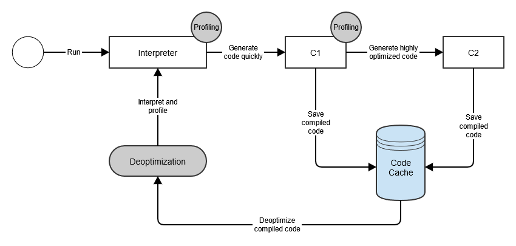

# 📃 JVM

<strong><h3> 💡 JVM의 역할에 대해 설명해주세요.</h3></strong>

1. 자바 소스 코드를 컴파일 하면, 자바 바이트 코드가 생성되는데,  
    <strong>JVM</strong>은 <strong>바이트 코드</strong>를 각 운영체제(자바 프로그램을 실행하는 환경)가 이해할 수 있는 <strong>기계어</strong>로 변환한다.   
   => 이는, 운영체제마다 바이트 저장 방식이 다르기 때문이다.

2. <strong>JVM</strong>은 <strong>Garbage Collection</strong>을 통해 자동으로 메모리 관리를 수행한다.
  

<strong><h3> 💡 JVM을 사용함으로써 얻을 수 있는 장점과 단점에 대해 설명해 주세요.</h3></strong>

  

 
<strong> ✅ 장점</strong>  

- JVM 위에서 실행되는 JVM 언어(Java, Kotlin, Scala ...)는 운영체제로부터 독립적으로 프로그램을 실행할 수 있다.     
- Garbage Collector가 메모리 관리를 대신 해주기 때문에 자바 프로세스가 한정된 메모리를 효율적으로 사용할 수 있어서 개발자는 개발에만 집중할 수 있다.

 
<strong> ✅ 단점</strong>  
   

- Java 프로그램은 JVM이라는 하나의 단계를 더 거치기 때문에, <strong>상대적으로 실행 속도가 느리다.</strong>

    =>  이러한 단점을 보완하기 위해 JIT 컴파일러를 사용해 성능을 향상 시켰지만, C언어의 실행 속도에는 미치지 못한다.   

- Garbage Collector가 메모리 관리를 대신 해주기 때문에 개발자는 메모리가 언제 해제되는지 정확히 알 수 없어 제어하기 힘들다.  
- GC가 동작하는 동안에는 다른 동작을 멈추기 때문에 오버헤드 <strong><u>(Stop The World)</u></strong>가 발생한다.

 

<strong><h3> 💡 JVM 메모리 구조에 대해 설명해 주세요.</h3></strong>

  
 

- ### <strong> 📌 Method 영역 </strong>  
    **바이트 코드**를 처음 메모리 공간에 올릴 때 **초기화되는 대상**을 저장하기 위한 메모리 공간이다.  
    JVM이 동작하고 클래스가 로드될 때 할당되어서, **프로그램이 종료될 때까지** 유지된다.
  
     
     
    <u>모든 스레드가 공유하는 영역</u>으로, 다음과 같은 정보가 저장된다.

    ✅ **Field Info** : 멤버 변수의 이름, 데이터 타입, 접근 제어자 정보  
    ✅ **Method Info**: 메소드의 이름, 반환 타입, 매개 변수, 접근 제어자 정보  
    ✅ **Type Info**: Class인지 Interface인지 여부 저장, Type의 속성/이름, Super Class의 이름

    <code><strong> 즉, 정적 변수와 .class 파일의 정보를 저장한다. </strong></code>
     
     

    

    
<strong> [Runtime Constant Pool]</strong>

    - Method 영역 내에 존재하는 별도의 관리 영역  

    - 각 클래스 / 인터페이스마다 별도의 Constant Pool 테이블이 존재하는데, 클래스 / 인터페이스를 생성할 때 참조해야 할 정보들을 <u>상수</u>로 가지고 있는 영역이다.

    - JVM은 Constant Pool을 통해 해당 메소드나 변수의 실제 메모리 상 주소를 찾아 참조한다.  

    - 상수 자료형을 저장하여 참조하고 중복을 막는 역할을 수행한다.
    

    

     

- ### <strong> 📌 Stack 영역 </strong>  
    <u>기본 자료형으로 생성된 지역 변수</u>가 저장되는 영역이다.  
    스택 영역은 각 스레드마다 존재하며, <strong>스레드가 시작될 때 할당된다.</strong>

     
    메소드 호출 시마다 각각의 스택 프레임이 생성되어 `지역 변수`, `매개 변수`, `반환 값` 을 임시로 저장했다가, 메소드의 수행이 끝나면 프레임이 삭제된다.

    

     
     
    

- ### <strong> 📌 Heap 영역 </strong>
  
  JVM이 관리하는 프로그램 상에서 데이터를 저장하기 위해 <strong>런타임 시 동적으로 할당</strong>하여 사용하는 영역으로, 모든 스레드에 공유된다.

  - **new 연산자**로 생성되는 객체가 저장된다.

  - 객체는 Heap 영역에 생성되고, 생성된 객체의 주소를 메소드 영역이나 스택 영역에서 참조한다.

  - Garbage Collection의 대상이 되는 영역이다.

     

- ### <strong> 📌 PC 레지스터 </strong>  
  
     현재 수행중인 JVM 명령어 주소를 저장하는 공간으로, 스레드가 어떤 부분을 무슨 명령으로 실행해야할 지에 대한 기록을 가지고 있다.
     <strong>스레드가 시작될 때</strong> 생성된다.
      
      

<strong><h3>💡 Java 프로그램 실행 과정에 대해 설명해주세요.</h3></strong>

 

    1️⃣ 소스 코드를 작성한다.
    2️⃣ 자바 프로그램을 실행하면 JVM은 OS로부터 메모리를 할당 받는다.
    3️⃣ 자바 컴파일러(javac)가 자바 소스 코드를 자바 바이트 코드로 컴파일한다.
    4️⃣ Class Loader는 동적 로딩을 통해 실행에 필요한 파일을 로딩 및 링크 하여 Runtime Data Area에 적재한다. (Loading → Linking→ Initialization)
    5️⃣ Execution Engine은 Class Loader를 통해 Runtime Data Area에 적재된 바이트 코드를 인터프리터와 JIT 컴파일러 두 가지 방식 중 선택하여 기계어로 변환한다.
    (📌 이때, 명령어의 실행은 JVM이 아닌, CPU에서 한다.)
    6️⃣ 5️번 과정에서 Execution Engine에 의해 Garbage Colletor의 작동과 Tread 동기화가 이루어진다.

<strong>📌 CPU에서의 명령어 실행</strong>

    1️⃣ 운영체제는 CPU에게 JVM이 실행되는 프로세스의 실행 시간을 할당한다.  
        CPU는 해당 프로세스의 명령어를 실행하기 위해 준비된다.  
    2️⃣ JVM 내부의 Execution Engine은 JVM의 PC 레지스터를 참조하여 현재 실행 중인 명령어의 주소를 가져온다.
    3️⃣ Execution Engine은 해당 주소에서 JVM의 바이트 코드를 가져와 해석한다.
    4️⃣ 해석된 명령어에 따라 Execution Engine은 CPU에게 해당 명령어를 전달하여 실행하도록 요청한다.
        이때, 명령어는 CPU가 이해하고 실행할 수 있는 기계어로 변환되어 전달된다.
    5️⃣ CPU는 전달받은 기계어를 실행하며, 해당 명령어에 따라 연산을 수행하거나 레지스터 값을 업데이트하고, 메모리에 접근하는 등의 동작을 수행한다.
    6️⃣ 명령어 실행이 완료되면, CPU는 다음으로 진행할 명령어를 가져와 실행한다. 
        이때 JVM의 PC 레지스터의 값이 업데이트 되어 다음 명령어의 주소를 가리킨다.

<strong><h3> 💡 JIT 컴파일러란 무엇이고, 이것은 왜 필요할까요?</h3></strong>

기존 Java는 인터프리터 방식으로 바이트 코드를 한 줄씩 기계어로 번역하여 실행했기 때문에 실행 속도가 느렸다. 

하드웨어가 발전하면서 <strong>실행 속도의 향상</strong>을 이루기 위해 JIT 컴파일러 방식을 도입했다.

### 📌 AOT 컴파일은 무엇일까요?
    AOT(Ahead-of-Time) 컴파일은 프로그램을 실행하기 전에 소스 코드를 기계어로 번환하는 컴파일 방식이다.

- JIT 컴파일 : <strong>런타임</strong>에 바이트 코드를 기계어를 변환한다.  (Java Hotspot VM의 기본 설정)  
- AOT 컴파일 : <strong>빌드 타임</strong>에 모든 바이트 코드를 기계어로 변환한다. (Graal VM의 기본 설정)

 

### 📌 C1 컴파일러와 C2 컴파일러는 무엇일까요?

 

- <h3>C1 컴파일러</h3>
    - 빠른 실행 속도를 위해 바이트 코드를 <strong>가능한 빠르게</strong> 최적화하고 컴파일한다.   
    - 특정 메서드가 C1 컴파일러의 임계치 설정 이상으로 호출되면, 해당 메서드의 코드는 C1 컴파일러를 통해 제한된 수준으로 최적화된다.   
    - Level 1 ~ 3의 코드는 C1 컴파일러에 의해 컴파일 된다.  
    - 컴파일된 기계어는 코드 캐시에 저장된다.

- <h3>C2 컴파일러</h3>
    -  C2 컴파일러는 C1 컴파일러보다 <strong>더 높은 수준의 최적화</strong>를 수행한다.     
    - 메서드가 C2 컴파일러의 임계치 설정보다 많이 호출되면, 코드는 C2 컴파일러에 의해 최적화되고 컴파일된다.  
    - Level 4의 코드는 C1 컴파일러에 의해 컴파일 된다.  
    - 컴파일된 기계어는 코드 캐시에 저장된다.

 

### 📌 컴파일 과정에서 컴파일러가 최적화해주는 것들은 무엇이 있을까요?

    ✅ + 연산을 StringBuilder로 변환해주기
    ✅ 반복문 펼쳐주기
    ✅ 탈출 분석
    ✅ 인라이닝
 

### 📌 힙에 메모리를 할당하는 과정에서 어떤 일들이 벌어지나요?

    new 연산자를 통해 객체가 생성되면, Eden 영역에 메모리를 할당하고 할당된 공간에 객체가 저장된다.

새로 생성된 객체는 Eden 영역에 저장되며, 단명 객체는 다른 영역에 들어가지 못하고 eden 에서 수집된다.  
따라서 eden 영역은 가장 관리가 잘 되어야 하는 영역이다.

### 📌 TLAB이란 무엇일까요?

.png>)

### TLAB(Thread Local Allocation Buffer)
- 각 스레드마다 개별적으로 할당되는 작은 메모리 영역  
- 다중 스레드 환경에서 <strong>메모리 할당과 관련된 경합 상황</strong>을 줄여 성능을 향상시키는 것을 목적으로 한다.
  
 

### 📌 TLAB은 어떤 문제를 해결하기 위해 만들어진 것일까요?

    전역 힙에서 메모리 할당 시 경합 상황이 발생하여 성능 저하가 발생할 수 있다.

 

🔥 그러나, TLAB를 사용하면 각 스레드가 독립적인 메모리 영역을 가지므로 메모리 할당과 관련된 경합 상황을 줄여 성능을 향상시킬 수 있다.

🔥 JVM은 eden을 여러 TLAB으로 나누어 application thread가 새로운 객체를 할당하는 공간으로 활용하도록 한다

🔥 동시성이 높은 멀티스레드 애플리케이션에서 특히 유용하다.

 

