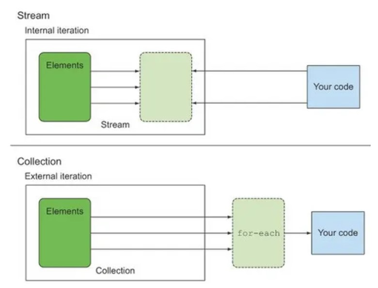
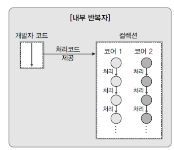
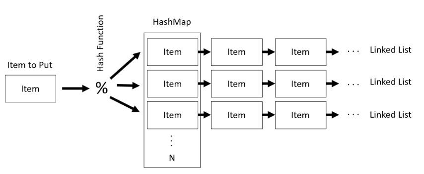
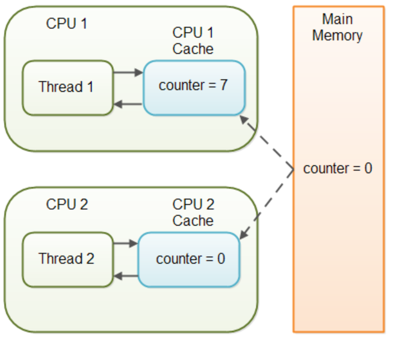

# 📃 Java

<strong><h3> 💡 제네릭에 대해 설명해주세요. </h3></strong>

    클래스나 메소드에서 사용할 내부 데이터 타입을 컴파일 시에 미리 지정하는 방법

### 📌 제네릭은 왜 사용하나요?
- 제네릭은 컴파일 타임에 타입 검사를 실행하기 때문에, <strong>런타임에 타입 안정성</strong>을 보장한다.  
    (런타임에 발생할 수 있는 ClassCastException을 컴파일 타임에서 체크 가능)

- 제네릭은 미리 타입을 지정하기 때문에, 런타임 시점에서 반환 값에 대한 타입 변환 및 타입 검사에 들어가는 오버헤드를 줄일 수 있다.

 

### 📌 제네릭의 변성에 대해 설명해주세요.

    🔥 제네릭은 기본적으로 무공변이다.

    어떠한 T 타입의 공변성을 허용하려면 <? extend T>를 사용한다.
    어떠한 T 타입의 반공변성을 허용하려면 <? super T>를 사용한다.

 

### 📌변성과 공변/반공변/무공변에 대해 설명해주세요.

<strong>변성</strong>은 타입의 상속 계층 관계에서 서로 다른 타입 간에 어떤 관계가 있는지를 나타태는 지표이다.

 

<strong>공변</strong> : `S` 가 `T` 의 하위 타입이면,
`List<S>` 는 `List<T>` 의 하위 타입이다.

<strong>반공변</strong> : `S` 가 `T`의 하위 타입이면,
T[] 는 S[] 의 하위 타입이다. (공변의 반대) 
`List<T>` 는 `List<S>` 의 하위 타입이다. (공변의 반대)

<strong>무공변</strong> : `S` 와 `T` 는 서로 관계가 없다.
`List<S>` 와 `List<T>` 는 서로 다른 타입이다.

 

<strong><h3> 💡 Java Stream API에 대해 설명해주세요.</h3></strong>

    Stream API는 컬렉션 / 배열에 저장된 요소들을 하나씩 참조하면서 반복적으로 처리할 수 있는 기능을 제공한다.

 

### 📌 Java Stream API의 특징에는 무엇이 있나요?

### 1️⃣ 원본의 데이터를 변경하지 않는다.
    Stream API는 원본 데이터를 복사하여 별도의 Stream을 생성하기 때문에 원본 데이터를 변경하지 않는다.

### 2️⃣ Stream은 일회용이다.

    재 사용이 가능한 Collection과 달리, Stream API는 일회용이다.  

만약 닫힌 Stream을 재 사용한다면 IllegalStateException이 발생하게 되므로, 재 사용이 필요한 경우에는 Stream을 다시 생성해주어야 한다.

 

### 3️⃣ 내부 반복으로 작업을 처리한다.
외부 반복을 통해 작업하는 Collection과 달리, Stream은 <strong>내부 반복</strong>을 통해 작업을 수행한다.

    🔥 내부 반복자는 멀티 코어 CPU를 최대한 활용하기 위해, 요소들을 분배시켜 병렬적으로 작업 할 수 있다.

 

### 4️⃣ Stream은 쉬운 병렬 처리를 지원한다.
    parallelStream() 메소드를 호출하여 병렬 Stream을 생성함으로써 손쉽게 병렬 처리할 수 있다.

### 5️⃣ Stream은 지연 연산을 수행한다.

    데이터 처리를 필요로 할 때까지 연산을 지연시키고, 필요한 연산만 수행하여 성능을 최적화할 수 있다.

 

스트림 파이프라인을 실행하게 되면 JVM은 곧바로 스트림 연산을 실행시키지 않는다.  

 

최소한의 필수적인 작업만을 수행하고자, 즉 지연 연산을 위한 준비작업을 수행한다. 
1. 스트림 파이프라인이 어떠한 중간 연산과 최종 연산으로 구성 되어 있는지 검사한다.  

2. 검사 결과를 바탕으로 JVM은 어떠한 방식으로 최적화를 진행할지 미리 계획하고, 그 계획에 따라 스트림의 개별 요소에 대한 스트림 연산을 수행하게 된다.
   
 

🔥 스트림에서 제공하는 최적화 전략으로는 <strong>루프 퓨전</strong>과 <strong>쇼트 서킷</strong>이 대표적이다.

 

<strong>[루프 퓨전]</strong>

 

    Stream 파이프라인에서 연속적으로 체이닝된 복수의 스트림 연산을 하나의 연산 과정으로 병합시키는 방법

 

<strong>[쇼트 서킷]</strong>

 

    불필요한 연산을 의도적으로 수행하지 않음으로써 실행 속도를 높이는 기법
    
    Ex) limit과 같은 쇼트 서킷 연산을 활용하여 스트림의 일부 요소들에 대한 연산을 완전히 생략한다.

 

 
 

### 📌 Stream과 for-loop의 성능 차이를 비교해 주세요.

    🔥 일반적으로 for-loop이 Stream보다 빠르다.

 

**🤷🏻‍♀️ 왜 for문이 더 빠를까?**

1. Stream은 <strong>매개변수를 통한 값 복사</strong>를 통해 원본 데이터의 불변성을 지원한다.  

    이로 인해 메모리 사용 증가, 복사로 인한 오버헤드 등으로 속도가 상대적으로 느리다.

 

2. <strong>Stream은 내부 최적화가 상대적으로 부족하다.</strong> 
   
    for-loop는 오래 전부터 사용되온 문법이기 때문에,
    for-loop에 대한 JIT Compiler의 내부 최적화가 잘 되어있는 반면
    
    Stream은 Java8 이후에 도입된 기능으로, 상대적으로 내부 최적화가 부족하기 때문이다.

 

### Stream 사용 시, for-loop 대비 속도 손실을 줄이려면

✅ Collection이 되는 스트림 소스의 크기가 충분히 크거나,     

✅ 컴퓨팅 연산이 CPU-intensive할 정도로 비용이 매우 비싸거나,    

✅ 병렬 스트림을 사용한다면, 스트림 소스인 Collection은 split하기 쉬운 자료 구조여야 하며, 연산이 stateful하지 않아야 한다.

 

🔥 가독성 / 유지 보수의 측면과 성능적인 측면을 고려해서 for-loop 또는 Stream을 선택해 사용하자.

 

<strong><h3> 💡 Java Lambda에 대해 설명해주세요. </h3></strong>

 
    
    🔥 함수를 하나의 식으로 표현한 것

 

-  **[특징]**
   - 람다식 내에서 사용되는 지역변수는 final이 붙지 않아도 상수로 간주된다.
   - 람다식으로 선언된 변수 명은 다른 변수명과 중복될 수 없다.

 

-  **[장점]**  

   <strong> 🤷🏻‍♀️ Java Lambda는 왜 만들어졌고, 어느 때 주로 사용할까요? </strong>

   - 개발자의 의도가 명확히 드러나 가독성이 높아진다.
   - 함수를 만드는 과정 없이 한번에 처리할 수 있어 생산성이 높아진다.
   - 병렬 처리가 용이하다.

 

- **[단점]**
  -  람다를 사용하면서 만든 익명 함수는 재 사용이 불가능하다.
  - 디버깅 시 함수 콜 스택 추적이 다소 어렵다

 
 

### 📌 람다가 사용하는 지역변수는 왜 Effectively Final 이어야 하는가?

 

    🔥 지역 변수가 스택에 저장되기 때문에 람다식에서 외부 지역 변수 값을 바로 참조하는 것에 제약이 있어 복사된 값을 이용하게 되는데,   
       이때, 멀티 쓰레드 환경에서 복사 될/복사된 값이 변경 가능 할 경우 이로 인한 동시성 이슈에 대응할 수 없기 때문이다.

 
 

람다식에는 다음과 같은 규칙이 존재한다.

    1️⃣ 람다식은 외부 block 에 있는 변수에 접근할 수 있다.
    2️⃣ 외부 block 에 있는 변수가 지역 변수 일 경우 final 혹은 *effectively final 인 경우에만 접근이 가능하다

 

<strong>[effectively final]</strong>

 

Java 8 에 추가된 syntactic sugar 일종으로, 초기화 된 이후 값이 한번도 변경되지 않았다면 effectively final 이라고 할 수 있다. 

effectively final 변수는 final 키워드가 붙어있지 않았지만 final 키워드를 붙힌 것과 동일하게 컴파일러에서 처리한다. 

 
 

외부 변수로 지역 변수를 이용하는 람다식(Local Capturing lambda)은 다음과 같은 특징이 있다.

<strong>1️⃣ 람다식에서 사용되는 외부 지역 변수는 복사본이다.</strong>   

    → 메소드 내 지역 변수를 참조하는 람다식을 리턴하는 메소드가 있을 경우, 메소드 block 이 끝나면 지역 변수가 스택에서 제거 되므로 추후에 람다식이 수행될 때 참조할 수 없다.
    → 지역 변수를 관리하는 스레드와 람다식이 실행되는 스레드가 다를 수 있다.

 

<strong>2️⃣ 🔥 final 혹은 effectively final인 지역 변수만 람다식에서 사용할 수 있다. </strong>

    람다식이 어떤 쓰레드에서 수행될지는 미리 알 수 없다. 
    이 얘기는 곧 외부 지역 변수를 다루는 쓰레드와 람다식이 수행되는 쓰레드가 다를 수 있다는 의미이다.
    
    지역 변수 값을 제어하는 스레드 A, 람다식을 수행되는 스레드 B 가 있다고 가정했을 때 문제는 다음과 같다.

    🙄 람다식에서 사용되는 외부 지역 변수 값이 가장 최신 값으로 복사되어 전달 됐는지 확신할 수 없다.
    왜냐하면 지역 변수는 변경될 수 있고, 지역 변수를 스레드 간에 동기화 해주는 것은 불가능 하기 때문이다. 

    이러한 문제점을 피하기 위해 람다에서 사용되는 외부 지역 변수는 전달되는 복사본이 변경되지 않은 최신 값 임을 보장하기 위해 fianl 혹은 effectively final 이어야 한다.

 

<strong><h3> 💡 Java의 Object클래스에는 equals() 와 hashCode() 라는 메소드가 선언되어 있습니다.   
  &nbsp;&nbsp; &nbsp; 이 메소드들은 각각 어떤 역할일까요? </h3></strong>

 

    equals()는 두 객체의 동일성을 판별한다.
    hashCode()는 객체의 주소를 해싱하여 해시 값을 만든 후 반환한다.

- 두 객체의 <strong>주소</strong>가 같다면 두 객체는 <strong>동일</strong>하다.  
-  두 객체의 <strong>논리적 지위</strong>가 같다면 두 객체는 <strong>동등</strong>하다.

 

### 📌hashCode() 를 잘못 오버라이딩하면 Hash Collection의 성능이 떨어질 수가 있습니다.   &nbsp; &nbsp; &nbsp;어떤 케이스일 때 그럴 수 있을까요?

    equals()만 오버라이딩 한 경우, 두 객체가 equals()로 동등하지만 hashCode() 값이 다르다면 서로 다른 버킷에 저장될 수 있다.  
    ➡ 버킷에 저장되는 객체의 수 증가 
    ➡ equals() 비교를 수행하는 불필요한 연산도 증가
    ➡ Hash Collection의 조회 성능 저하

🔥 따라서, equals() 메서드를 오버라이딩한 경우에는 반드시 hashCode() 메서드도 함께 오버라이딩 해야한다.

 

<strong>[ Hash Collection과 Hash 충돌 ]</strong>

 

Hash Collection은 **<key, value>** 형태로 데이터를 저장한다. 

버킷의 크기(M)는 한정되어 있기 때문에  **`hashCode()`** 를 이용해 key 값을 기준으로 만들어진 해시 값을 M으로 나눈 나머지를 버킷의 인덱스로 사용한다

`int index = x.hashCode() % M;`

 

따라서, **해시 충돌**이 발생할 수 있다. 

해시 충돌이 발생할 경우,

- jdk 8 이전 : Linked List 활용한다.

 

- jdk 8 이후: Linked List와 Red Black Tree를 활용한다.  
(충돌 개수가 8개 초과이면 Tree로 변경,    
 &nbsp; 충돌 개수가 6개 미만이면 Linked List로 변경)

 

버킷의 특정 인덱스에 해시 충돌이 존재하는 경우, **`equals()`** 메소드가 사용된다.

 

✅ 해시 충돌 상황에서, 객체를 삽입하는 경우

- equals()가 true인 객체가 있다면 해당 객체를 덮어쓴다.  
- equals()가 true인 객체가 없다면, 해당 Entry를 추가한다.  

 

✅ 해시 충돌 상황에서, 객체를 조회하는 경우

- equals()가 true인 객체가 있다면 해당 객체를 반환한다.  
- equals()가 true인 객체가 없다면, null을 반환한다.  

 
 
 

<strong><h3> 💡 String과 StringBuffer의/StringBuilder의 차이는 무엇일까요?  </h3></strong>

 

    String은 불변 클래스이기 때문에 매 연산 시마다 새로운 문자열을 가진 String 인스턴스가 생성되지만,

    StringBuffer / StringBuilder는 가변 클래스이기 때문에 새로운 인스턴스의 생성 없이 문자열 연산이 가능하다.

 

<strong>[ 더 알아보기 ]</strong>

 

String 자료형 만으로도, +연산이나 concat()으로 문자열을 추가할 수 있다.   
하지만, 기본적으로 **String 객체는 불변 클래스**이기 때문에 concat()은 동작 수행 후 매번 새로운 String 인스턴스를 반환하고,  
이는 자원 낭비와 성능 저하를 야기한다.

 

StringBuffer나 StringBuilder의 경우 버퍼의 크기를 유연하게 조절하는 **가변 클래스**이다.  
두 클래스는 내부적으로 버퍼(buffer)라고 하는 독립적인 공간을 가지기 때문에 버퍼 내에서 문자열 연산을 할 수 있도록 설계되어 있다.  
따라서, 자원 낭비가 없고, 연산 속도도 매우 빠르다는 특징이 있다.  

 

<strong>[ 성능을 고려한 문자열 자료형 선택 ]</strong>

 

StringBuffer나 StringBuilder를 생성할 경우, buffer의 크기를 지정해줘야 한다.

StringBuffer나 StringBuilder에서 문자열 연산을 할 경우, 마찬가지로 버퍼의 크기를 조절하는 내부적인 연산이 필요하므로,  
많은 양의 문자열 수정이 아니라면 String 객체를 사용하는것이 오히려 나을 수 있다.  
또한, String 클래스는 크기가 고정되어 있으므로 단순한 조회 연산에서는 StringBuffer나 StringBuilder 클래스보다 빠르다.

즉, 문자열 연산 작업이 많을 경우에는 StringBuffer나 StringBuilder를, 그렇지 않은 경우에는 String을 사용하는 것이 좋다.

 

### 📌 StringBuffer와 StringBuilder의 차이는 무엇일까요?

 
    
     ✅ StringBuffer는 동기화를 지원하므로, 멀티 스레드 환경에서 안전하다.
     ✅ StringBuilder는 동기화를 지원하지 않으므로, 싱글 스레드 환경에서의 사용을 가정한다.

 

<strong> 🔥 StringBuffer는 메소드에서 synchronized 키워드를 사용하기 때문이다.</strong>
 

<strong>[ Java의 synchronized 키워드 ]</strong>

 

synchronized 키워드는 여러 스레드가 동시에 공유 자원에 접근할려고 할 때,   
현재 데이터를 사용하고 있는 스레드를 제외한 나머지 스레드들이 데이터에 접근할 수 없도록 막는 역할을 수행한다.

 
 

### 📌 왜 동기화(synchronized)가 걸려있으면 느린걸까요?
 

동기화된 코드 블록이나 메서드는 여러 스레드 간에 상호배제를 위해 <strong>락(lock)</strong>을 사용한다.

1️⃣ 락을 획득하고 반환하는 과정, 스레드 간의 대기 및 깨움 작업 등은 프로그램의 실행 속도를 느리게 만들 수 있다.   

2️⃣ 동기화된 코드에서는 스레드 간의 경합이 발생하여 성능에 영향을 미칠 수 있다.

 

### 📌 싱글 스레드로 접근한다는 가정하에선 "StringBuffer" 와 "StringBuilder" 의 성능이 똑같을까요?
    
     

싱글 스레드에서는 스레드 간의 경합이 발생하지 않지만, synchronized 키워드로 동기화된 블록에 진입할 경우,  
<strong>여전히 락을 획득하고 작업을 수행한 후 락을 반환하는 과정</strong>을 거치기 때문에 추가적인 <strong>오버헤드</strong>를 초래한다.

 

🔥 따라서, 싱글 스레드 환경에서는 StringBuilder의 성능이 더 좋다.

 

    🤷🏻‍♀️ 흐음 포인트)

    싱글 스레드 환경이거나, 비동기를 사용할 일이 없으면 StringBuilder를 쓰는 것이 이상적이라 할 수 있다.
    하지만 현업에서, 자바 어플리케이션은 대부분 멀티 스레드 환경에서 돌아가기 때문에 Thread Safe를 지원하는 StringBuffer로 통일하여 코딩하는것이 좋다. 
    (StringBuffer 와 StringBuilder 속도 차이는 미미하다고 한다.)

 

<strong><h3> 💡 0이 들어있는 변수에 10개의 스레드가 동시에 접근해서 ++ 연산을 하면   &nbsp; &nbsp; 우리 예상과 다르게 10이 나오지 않습니다. 왜 그럴까요? </h3></strong>

    🔥 여러 스레드가 동시에 변수에 접근하여 증가 연산을 수행할 때, 
       경쟁 상태(race condition)로 인해 예상과 다른 결과가 나타날 수 있다.

 
    
### 📌 경쟁 상태는 무엇인가요?
    
    🔥 경쟁 상태는 여러 스레드가 공유된 자원에 동시에 접근할 때 발생하는 문제이다.

    예를 들어, 여러 스레드가 동시에 변수에 접근하여 값을 증가시키는 경우,
    스레드 간의 실행 순서나 시간 차 등에 따라 의도하지 않은 결과가 발생할 수 있다.
    
 

### 📌 ++ 연산은 구체적으로 어떤 행위들로 이루어져 있을까요?

++ 연산은 다음 세 가지 단계로 구성된다.
  
   1. 메모리에서 해당 값을 가져온다.  
   2. 해당 값에 1을 더한다.  
   3. 더한 값을 메모리에 덮어 씌운다.  

 

➡ 이 단계들은 각각의 스레드에 의해 수행되지만, 스레드들은 **동시에** 이러한 단계를 수행한다.  
➡  따라서, 이러한 상황에서 **스레드 간의 실행 순서와 시간 차**에 따라 예상과 다른 결과가 나타날 수 있다.

 

### 📌 이 문제를 해결하려면 어떻게 해야할까요?

    🔥 경쟁 상태를 해결하기 위해 동기화 기법을 사용할 수 있다.

**동기화**를 통해 스레드 간 **상호 배제**를 보장하고, 정확한 실행 순서를 유지할 수 있다.     
 

예를 들면, **상호 배제**를 위해 **락(lock)** 이라는 동기화 기법을 사용하여 한 번에 하나의 스레드만 변수에 접근하도록 제어할 수 있다.   
(+ 다른 동기화 기법으로는 세마포어와, 뮤텍스가 있다.)

 

### 📌 `synchronized` 키워드는 이 문제를 어떻게 해결하는걸까요?

    1️⃣ `synchronized` 키워드를 사용하면 메소드나 코드 블록을 동기화할 수 있다.  
    2️⃣ 동기화된 메소드나 코드 블록에는 오직 하나의 스레드만 접근할 수 있으며, 다른 스레드는 대기 상태에 있게 된다.  
    3️⃣ 진입한 스레드가 연산을 수행하고 나면, 다른 스레드들은 대기 상태에서 벗어나서 순차적으로 실행된다.  

    ➡ 이를 통해 스레드 간의 경쟁 상태를 방지하고, 정확한 실행 순서를 유지할 수 있다.

 
 

<strong><h3> 💡 Java에서 동시성과 관련된 키워드를 모두 말씀해주세요. </h3></strong>

    🔥 동시성과 관련된 예약어에는 synchronized와 volatile가 있다.

 

### 📌 **`volatile` 키워드는 어떤 키워드일까요?**

 

volatile 키워드는 변수를 '**Main Memory**에 저장하겠다고 명시하는 것이다.  
→ avolatile 키워드는 Java 변수를 Main Memory에 저장하고, 읽어오기 때문에, **변수 값 불일치 문제**를 해결할 수 있다. **(가시성 보장 O)**

 

### 📌 **`volatile`** 키워드는 `가시성`을 보장해준다고 하는데, 이게 어떤 말일까요?

 

**🤷🏻‍♀️ `volatile` 키워드를 사용하지 않는다면?**

멀티 스레드 환경에서는 작업을 수행하는 동안, `성능 향상`을 위해 Main Memory에서 읽은 변수 값을 CPU Cache에 저장한다.  
따라서, 각 CPU Cache에 저장된 값이 다르기 때문에 스레드가 변수 값을 읽어올 때 **변수 값 불일치 문제**가 발생하게 된다. **(가시성 보장 X)**

 

**[ 동기화의 기능 ]**

1. 배타적 실행을 보장한다. (**상호 배제** ⇒ **`syncronized`**)

2. 한 스레드에서 발생한 변수의 변경 사항이 다른 스레드에게 즉시 반영되어        
    최신 값을 얻을 수 있도록 한다. (**가시성** ⇒ **`volatile`**)

🔥  
**`syncronized`** **상호 배제**와 **가시성**을 모두 지원한다.  
⇒ lock을 통해 상호 배제 지원  
⇒ 코드 블록에 진입하기 전 CPU Cache와 Main Memory 값을 동기화 하여 가시성 지원

**`volatile` 가시성**만을 지원한다.  
⇒ 변수에 대한 read / write작업이 **Main Memory**에서 이루어짐을 명시하여 가시성 지원

 

### 📌 volatile은 어떤 상황에서 쓸 수 있을까요?

   1. 멀티 스레드 환경에서 하나의 스레드만 변수를 read / write하고, 나머지 스레드는 read만 하는 상황에서   
**가시성**을 보장해야 할 때 사용한다.  
    ⇒  여러 스레드가 write하는 상황에서 **`volatile`** 는 적합하지 않으며, 이 경우 **`synchronized`** 를 사용해 상호 배제를 보장해야 한다.

   2. CPU Cache보다 Main Memory 에서 read / wirte 비용이 더 크기 때문에 **가시성**을 보장해야 하는 경우에만 **`volatile`** 를 사용하는 것이 좋다.

   3. **`volatile`** 로 선언된 변수가 있는 코드는 최적화되지 않으므로, **가시성**이 중요한 경우에만 사용하는 것이 좋다.

 

<strong><h3> 💡 Blocking IO와 Non-Blocking IO 의 차이를 말씀해주세요. </h3></strong>

 

    어떤 스레드가 I/O 작업을 요청한 경우,
    Blocking I/O ➡ I/O 작업이 완료될 때까지 대기하면서 다른 작업을 수행하지 못한다.
    Non-Blocking I/O ➡ I/O 작업을 시작한 후에도 다른 작업을 수행할 수 있다.

 

### 📌 Blocking I/O 가 일어나면 스레드에는 무슨 일이 생길까요?

    1️⃣ 스레드가 블로킹 I/O 작업을 요청한다.
    2️⃣ 커널은 I/O 작업을 시작하도록 요청받는다.
    3️⃣ 해당 스레드는 I/O 작업의 완료를 기다리는 동안 대기 상태에 머무르게 된다.  
    4️⃣ I/O 작업이 완료되면 커널은 스레드에게 작업 결과를 반환한다.
    5️⃣ 스레드는 작업 결과를 받아온 후 다음 동작을 수행한다.  

 

### 📌 스레드가 멈춰있는 동안 CPU는 어떻게 될까요?  

 

### 🤷🏻‍♀️ 블로킹 I/O가 발생하여 스레드가 대기 상태에 머물러 있는 동안..

### **싱글 스레드 환경에서는,**  
다른 작업을 수행할 수 있는 스레드가 없으므로, **CPU는 아무 작업도 수행하지 않는다.**    
I/O 작업이 완료되면 스레드는 작업 결과를 받아온 후 다음 동작을 수행한다.

 

### **멀티 스레드 환경에서는,**  
CPU는 **다른 실행 가능한 스레드에게 CPU 시간을 할당하여 다른 작업을 수행한다.**    
I/O 작업이 완료된 스레드는 실행 대기 상태로 전환되어 CPU 시간을 기다리다가,  
CPU 스케줄러가 해당 스레드에게 CPU 시간을 할당할 때, 작업 결과를 받아온 후 다음 동작을 수행한다.

 

### 📌 스레드를 늘리면 단점이 무엇일까요?

- 자원 사용량 증가
- 컨텍스트 스위칭 비용 증가
- 관리 및 디버깅의 어려움

 

<strong>[ 톰캣은 어떻게 Blocking I/O 방식을 사용하면서도 CPU 활용을 향상 시키고,  많은 스레드 사용의 단점을 극복했을까? ]</strong>

 

**톰캣은 일반적으로 Blocking I/O 방식을 사용하기 때문에 CPU 활용을 향상시키기 위해 수백 개의 스레드를 활용한다.**

그러나 스레드를 너무 많이 생성하는 것은 위와 같은 단점을 가질 수 있다.

이를 극복하기 위해 톰캣은 **스레드 풀(Thread Pool)** 을 활용한다.  
스레드 풀을 통해 미리 생성된 스레드들을 관리하고, 요청이 들어올 때마다 해당 스레드를 할당하여 작업을 처리한다.   
작업 처리가 완료되면 스레드는 풀로 반환되어 재사용 된다.

스레드 풀을 사용함으로써 스레드 생성 및 제거에 따른 오버헤드를 줄이고, 자원을 효율적으로 활용할 수 있다.   
또한, 스레드 관리와 디버깅이 용이해지며 작업 처리를 조절할 수 있는 작업 큐와의 결합도 가능하다.

 
 
 

  

<strong><h3> 💡 System.out.println 메소드는 현업에서 절대 쓰지 말라고하는 메소드인데요.   &nbsp;&nbsp;&nbsp;&nbsp; 그 이유가 무엇일까요? </h3></strong>

 

    System.out.println()은 Java에서 표준 출력을 위해 사용되는 메서드 중 하나로,

    ✅ Blocking I/O 방식으로 작동한다.
    ✅ println()에서 내부적으로 호출하는 newLine()은 syncronized 메소드이다.

 

이러한 이유로, 현업에서는 System.out.println 대신 **Log4j나 SLF4J와 같은 로깅 프레임워크**를 사용하는 것이 권장된다.  

로깅 프레임워크는 출력 레벨을 설정할 수 있어서 필요한 정보만 출력할 수 있으며, 출력 방법도 다양하게 설정할 수 있어서 유연성이 높다.   
또한, 멀티스레드 환경에서도 안전하게 사용할 수 있다.

 

### 📌 synchronized 가 Blocking IO 와 만나면 어떻게 환장의 성능하락을 만들 수 있는걸까요?  

 

synchronized 블록은 한 번에 하나의 스레드만이 진입할 수 있는 **임계 영역**으로 제한되고,   
**synchronized 블록 내에서 Blocking I/O 호출이 발생하면** 스레드는 해당 I/O 작업이 완료될 때까지 기다려야 한다.    

syncronized 블록은 임계 영역이므로, **다른 스레드 역시 해당 블록에 접근할 때 대기**해야 한다.  
결과적으로, 다른 스레드들은 해당 블록에 접근하기 위해 블로킹 작업이 완료될 때까지 기다려야 하므로 CPU 자원이 낭비되며,   
프로그램의 처리량이 감소할 수 있다.  

특히, Blocking I/O를 자주 수행하거나, 많은 스레드가 동시에 Blocking I/O를 사용하는 경우 이러한 성능 저하가 더욱 두드러질 수 있다.

 
 

<strong><h3>💡 Serializable 은 무엇일까요? </h3></strong>

 

    🔥  자바 직렬화 기능을 사용할 수 있도록 하는 마커 인터페이스이다.
    
 

### 📌 직렬화 / 역직렬화란 무엇인가요?

    🔥 객체를 바이트 스트림으로 변환하는 과정을 직렬화라고 한다.
       반대로, 바이트 스트림을 객체로 변환하는 과정은 역직렬화라고 한다.  

 

### 📌 직렬화의 포맷엔 무엇이 있을까요?

    JSON, XML, ETC ....

