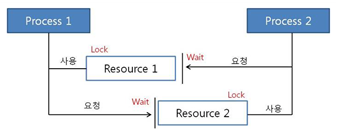
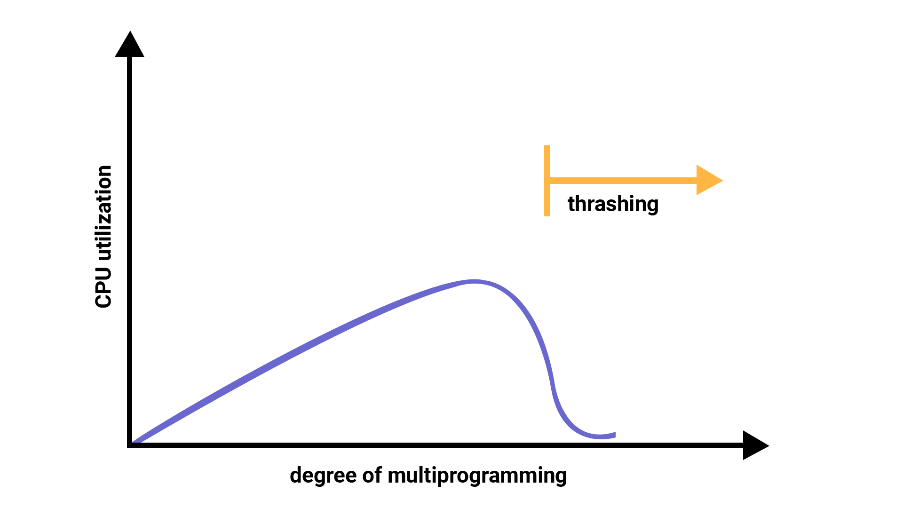
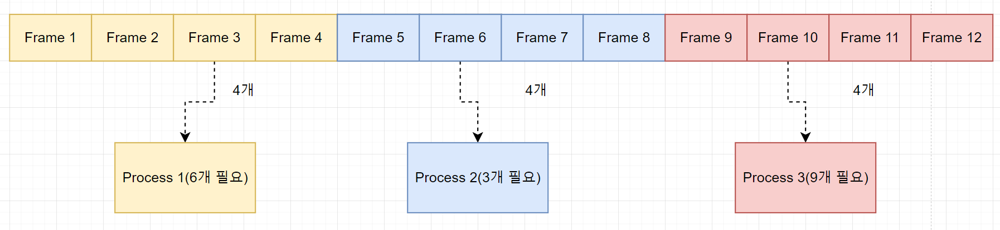
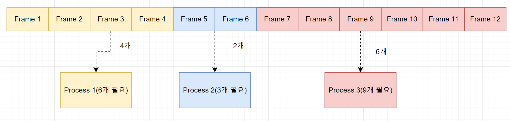
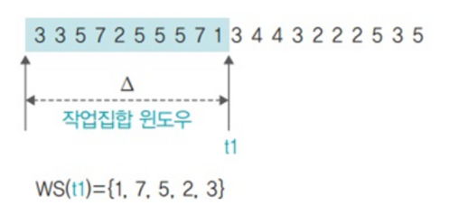
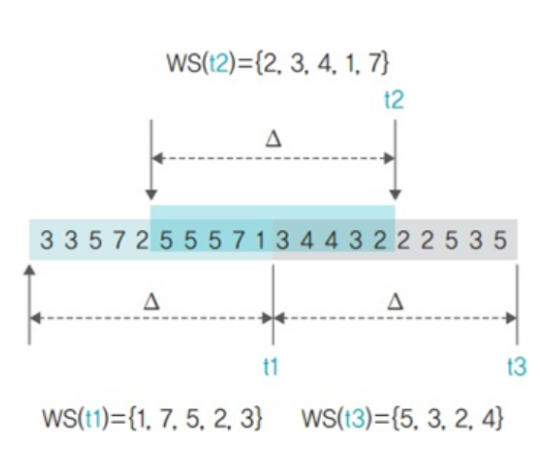
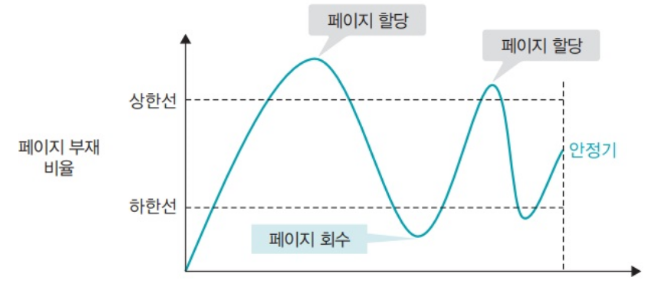

# 📃 운영체제 

<strong><h3> 💡 프로세스와 스레드의 차이에 대해 설명해주세요.</h3></strong>

 

**프로세스**  
- 운영체제로부터 자원을 할당 받은 **작업의 단위**  
- 각 프로세스는 독립적인 메모리 영역을 할당 받는다.  

**스레드**  
- 프로세스가 할당 받은 자원을 이용하는 **실행 흐름의 단위**  
- **스택 영역과 PC 레지스터 영역만 독립적으로 할당** 받고, 나머지 영역은 동일한 프로세스 내의 스레드 간 공유 된다.  

 
 

### 📌 스레드에 스택 영역과 PC 레지스터 영역만 독립적으로 할당하는 이유가 무엇일까요?

 

### ✔ 스택 영역을 스레드마다 독립적으로 할당하는 이유

스택은 메소드 호출 시 전달되는 인자, 되돌아갈 주소 값 및 지역 변수 등을 저장하기 위해 사용되는 메모리 영역이다.  

스택 메모리 영역이 독립적이라는 것은 스레드 간 독립적인 함수 호출이 가능하다는 것이고, 이는 독립적인 실행 흐름을 가능하게 한다.
 
따라서 **독립적인 실행 흐름을 위한 최소 조건**으로 각 스레드에 독립된 스택 영역을 할당한다.  
 

### ✔ PC 레지스터 영역을 스레드마다 독립적으로 할당하는 이유
PC 레지스터는 CPU가 다음에 실행할 명령어의 주소를 저장한다.

여러 스레드가 하나의 PC 레지스터를 공유한다면, 한 스레드가 PC 레지스터에 새로운 명령어 주소를 저장하는 동시에 다른 스레드가 PC 레지스터의 값을 읽거나 변경하는 상황이 발생할 수 있다.
이렇게 동시에 여러 스레드가 PC 레지스터에 접근하면, 다음에 실행될 명령어의 주소를 신뢰할 수 없게 되며, 스레드들의 실행 흐름이 망가지는 등 예기치 못한 동작과 오류가 발생할 수 있다.

따라서 각 스레드에게 독립적인 PC 레지스터를 할당하여 각 **스레드가 자신의 실행 흐름을 안정적으로 유지하고, 다음에 실행할 명령어의 주소를 독립적으로 관리**할 수 있도록 한다.

 
 

### 📌 프로세스에 대해 자세히 설명해주세요.

### ✔ 프로세스

- 실행을 위해 **커널**에 등록된 작업  
    (시스템 성능 향상을 위해 커널에 의해 관리 된다.)

- 각종 자원을 요청하고, 할당 받을 수 있는 개체  
- **PCB**를 할당 받은 개체  

*자원 : 커널의 관리 하에 프로세스에게 할당/반납 되는 수동적인 개체
 
 
 

### 📌 PCB는 무엇인가요?

### ✔ PCB

- **커널 공간**에 존재한다.  

- OS는 **`프로세스 관리`** 를 위해 각 프로세스에 대한 정보를 관리하는데, 각 프로세스의 정보가
PCB에 저장된다.  
(* 프로세스 관리: 프로세스가 여러 개일 때, CPU가 스케줄링을 통해 프로세스를 관리하는 것)
- 프로세스 생성 시 생성된다.
- PCB가 관리하는 정보
    - PID(프로세스 고유 식별 번호)
    - 스케줄링 정보 (프로세스 우선 순위, CPU 점유 시간)
    - 프로세스 상태 (자원 할당 및 요청 정보)
    - 메모리 관리 정보 (page table, segment table)
    - 입출력 상태 정보 (할당 받은 입출력 장치/파일 등에 대한 정보)
    - 문맥 저장 영역(프로세스의 레지스터 상태를 저장하는 공간)
    - `Linked List` 방식으로 관리된다.
        - PCB List Head에 PCB가 생성될 때마다 붙게 된다.
        - 주소 값으로 연결이 이루어져 있는 연결 리스트이기 때문에 삽입/삭제가 용이하다.

 
 

### 📌 스레드는 PCB를 가지고 있을까요?

 

    🔥 스레드는 PCB를 갖고 있지 않다. 

    스레드는 프로세스 내에서 실행되는 실행 흐름의 단위로, PCB는 프로세스 단위로 생성되고 관리되는 자료구조이다.

 

여러 개의 스레드가 하나의 프로세스 내에서 동작하면, 모든 스레드는 동일한 프로세스의 자원을 공유하게 된다.   
따라서 스레드는 **프로세스 내부의 메모리 영역을 공유**하고, 프로세스가 할당 받은 PCB를 공유하여 프로세스의 상태를 스레드들이 함께 사용한다.

즉, 프로세스의 PCB에는 프로세스 자체의 정보와 상태를 저장하지만, 스레드는 프로세스 내에서 실행되므로 프로세스 자체와   
밀접하게 연관되어 있어 별도의 PCB를 가질 필요가 없다.

 
 

### 📌 멀티 프로세스와 멀티 스레드의 특징에 대해 설명해주세요.
 

### ✔ 멀티 프로세스

- 각 프로세스는 독립적인 메모리 공간을 가지기 때문에 서로 영향을 주지 않고 실행 된다.     
    즉, 한 프로세스의 오류나 비정상 종료가 다른 프로세스에 영향을 미치지 않는다.  

- 프로세스 간 데이터를 주고받기 위해서는 별도의 **IPC** 기법을 사용해야 하며, 이로 인해 오버 헤드가 발생한다.
- 각 프로세스마다 메모리 주소 체계가 다르기 때문에, 프로세스 컨텍스트 스위칭시 메모리 관련 처리가 따로 필요하여 오버 헤드가 비교적 크다.

### ✔ 멀티 프로세스

- 스레드는 하나의 프로세스 내에서 동작하며, 주소 공간과 자원을 공유한다.  
    따라서 데이터 공유가 간편하고, IPC 없이도 쓰레드 간 데이터를 주고받을 수 있습니다.

- 같은 프로세스에 속하는 스레드는 메모리 영역을 공유하기 때문에, **스레드 컨텍스트 스위칭** 시
메모리 관련 처리가 따로 필요하지 않아 오버 헤드가 비교적 적다.

-  공유된 자원에 대한 접근과 변경을 적절하게 관리하지 않으면 데드락과 같은 **동기화 문제**가 발생할 수 있다.

 
 

### 📌 멀티 스레드의 동시성과 병렬성을 설명해주세요.

### ✔ 동시성
**싱글 코어**에서 멀티스레드를 동작시키기 위한 방식으로,   
멀티태스킹을 위해 여러 개의 스레드가 **`번갈아가면서 실행되는 성질`** 을 말한다.   
(동시에 실행하는 것처럼 보이지만 **사실은 번갈아가며 실행** 하고 있는 것임)

### ✔ 병렬성
**멀티 코어**에서 멀티스레드를 동작시키는 방식으로,   
한 개 이상의 스레드를 포함하는
각 코어들이 '동시에' 실행되는 성질을 말한다.

.png>)

<strong><h3> 💡 스레드를 많이 쓸수록 항상 성능이 좋아질까요?  </h3></strong>

    🔥 어플리케이션의 성격과 컨텍스트 스위칭 오버헤드를 고려할 때, 
    스레드를 많이 사용하는 것이 항상 성능 향상을 보장하지는 않는다.

 

**스레드를 많이 사용하면 동시에 더 많은 작업을 실행할 수 있다** 는 이야기는 해당 어플리케이션이 작은 작업들로 분할하여 동시 실행 가능한 성격을 가지고 있다는 전제를 필요로 한다.   

 

그러나 어떤 어플리케이션이 순차적으로 실행되어야 하는 특성을 가지고 있다면,   
작은 작업으로 분할하여 동시 실행하기가 어려울 수 있으며, 이런 경우에는 스레드 수를 계속 늘려도 성능 향상에 한계가 있다.  

 

또한, CPU의 코어 수는 고정되어 있으며 스레드 수를 계속 늘리면 각 코어에서 스레드 간의 경합이 더 많아진다.   
이에 따라 **컨텍스트 스위칭**으로 인한 오버헤드가 증가하므로 성능 면에서 한계에 도달하게 된다.

 

CPU 바운드 어플리케이션은 CPU를 많이 사용하므로, 코어 수와 비슷한 수준 이상으로 스레드 수를 늘려봤자 성능 향상이 거의 없을 뿐만 아니라,   
오히려 각 코어에서 스레드 간의 경합으로 인해 컨텍스트 스위칭 오버헤드로 성능이 저하될 수 있다.

반면, I/O 바운드 어플리케이션은 CPU가 대기 상태에 있을 가능성이 높기 때문에, 코어 수보다 2배, 3배 이상으로 스레드 수를 늘림으로써 코어들을 더 효율적으로 활용하여 성능상 이점을 얻을 수 있다.

<strong><h3> 💡 데드락(Deadlock)에 대해 설명해주세요.</h3></strong>

 

    멀티 스레드 또는 멀티 프로세스 환경에서 발생하는 동기화 문제로, 
    자원을 점유한 상태에서 다른 프로세스가 점유하고 있는 자원을 요구하며 무한정 기다리는 상황을 말한다.

프로세스 1과 2가 자원1, 2를 모두 얻어야 한다고 가정해보자

t1: 프로세스1이 자원1을 얻음 / 프로세스2가 자원2를 얻음  
t2: 프로세스1은 자원2를 기다림 / 프로세스2는 자원1을 기다림  
→ **🔥 데드락**

 
 

### 📌 데드락이 발생하는 조건을 설명해주세요.

다음 네 가지 조건을 **동시에** 충족해야 한다.

- **상호 배제(Mutual Exclusion)**  
  리소스는 한 번에 하나의 프로세스 또는 스레드만이 사용할 수 있어야 한다.   
  즉, 한 프로세스 또는 스레드가 리소스를 사용 중인 경우, 다른 프로세스나 스레드는 해당 리소스에 접근할 수 없어야 한다.  

- **점유 대기(Hold and Wait)**   
  하나 이상의 리소스를 점유한 상태에서 다른 리소스를 기다리는 상태여야 한다.   
  즉, 프로세스나 스레드가 이미 리소스를 하나 이상 가지고 있으면서 또 다른 리소스를 얻기 위해 대기하고 있어야 합니다.

- **비선점(Non-Preemption)**   
  프로세스나 스레드가 얻은 리소스를 다른 프로세스나 스레드가 강제로 빼앗을 수 없어야 한다.  
    리소스는 해당 프로세스나 스레드가 명시적으로 릴리스해야만 해제된다.    

- **순환 대기(Circular Wait)**   
  두 개 이상의 프로세스나 스레드가 서로가 서로의 리소스를 기다리고 있어야 한다.  
   즉, 사이클 형태로 리소스가 대기 상태에 있어야 한다.  

 
 

### 📌 데드락은 어떻게 해결할 수 있을까요?

 

    - 데드락 예방
    - 데드락 회피
    - 데드락 탐지 및 복구

 

### ✅ 데드락 예방
- **데드락 발생 필요 조건 4가지** 중 **하나를 제거**함으로써 데드락을 예방한다.  

- 데드락이 **절대 발생하지 않도록** 하는 방법이다.
- 심각한 자원 낭비가 발생하므로, **비현실적인** 방법이다.

### **상호 배제(Mutual Exclusion) 조건 제거**  
  - **모든 자원**에 대해, **공유**를 허용한다.  
  - **현실적으로 불가능**한 방법  
  
### **점유 대기(Hold and Wait) 조건 제거**
  - 필요한 자원을 **한번에 모두 할당**한다.
  - **자원이 필요하지 않은 순간에도 점유**하고 있으므로, **자원 낭비**가 발생한다.
  - 무한 대기 현상이 발생할 수 있다.

### **비선점(Non-Preemption) 조건 제거**  
  - **모든 자원**에 대해, **선점**을 허용한다.
  - **현실적으로 불가능**한 방법  
  ( ⇒ 프로세스가 할당 받을 수 없는 자원을 요청하는 경우,
           해당 프로세스가 가지고 있던 자원을 모두 반납하고  
            작업을 취소하는 방법으로 유사하게 구현할 수 있으나, 이 방법 또한
           심각한 자원 낭비가 발생하므로 비현실적이다.)

### **순환 대기(Circular Wait) 조건 제거**  
  - 자원에 **순서를 부여**하고, 프로세스는 **순서의 증가 방향으로만 자원 요청**이 가능하도록 한다.
  - **자원 낭비**가 발생한다.

 

----
 

### ✅ 데드락 예방 회피

- 시스템의 **상태를 계속 감시함**으로써, 데드락 상태가 될 가능성이 있는
자원 할당 요청을 보류하여 데드락의 발생을 막을 수 있다.

- 항상 시스템을 감시하고 있어야 하므로, 오버 헤드가 크다.
- 시스템을 항상 **safe state**로 유지하는 방법이다.

  (***safe state**: 모든 프로세스가 정상적 종료 가능한 상태,  
                   safe sequence가 하나라도 존재하면 safe state이다.
                   데드락 상태가 되지 않을 수 있음을 보장한다.

  ***unsafe state**: 데드락 상태가 될 가능성이 있는 상태,
                     반드시 데드락이 발생한다는 의미는 아니다.)

- safe state를 유지하기 위해 **사용되지 않는 자원이 존재한다.**
- 가정이 성립되기 어렵다. 즉, **비현실적**이다.

 

**가정**
- 프로세스의 수가 고정됨
- 자원의 수와 종류가 고정됨
- 프로세스가 요구하는 자원 및 최대 수량을 알고 있음
- 프로세스는 자원을 사용 후 반드시 반납함

 

### **다익스트라 은행원 알고리즘**
    - 데드락 회피를 위한 간단한 이론적 기법
    - 가정 : 한 종류의 자원이 여러 개 존재
    - 목표 : 시스템을 항상 safe state로 유지
    - 현재 상태에서 safe sequence가 하나라도 존재하면, safe state임

 

### **헤버만 알고리즘**
    - 다익스트라 은행원 알고리즘의 확장
    - 가정 : 여러 종류의 자원이 여러 개 존대
    - 목표 : 시스템을 항상 safe state로 유지

 

----

 

### ✅ 데드락 탐지

- 데드락 방지를 위한 사전 작업을 하지 않는다. 즉, **데드락이 발생할 수 있다.**

- **주기적으로 데드락 발생 여부를 확인**한다.  
  (시스템이 데드락 상태인지, 어떤 프로세스가 데드락 상태인지)

- **Resource Allocation Graph (RAG)** 를 사용한다.
- 검사 주기에 영향을 받는다.
- 노드의 수가 많은 경우, 오버 헤드가 크다.

 

### **Graph reduction procedure**
  1. 필요한 자원을 모두 할당 받을 수 있는 프로세스(Unblocked Process)에 연결된 모든 edge를 제거한다.  
  2. 더 이상 Unblocked Process가 없을 때까지 1번을 반복한다.  
  3. 최종 그래프에서   
     a.  **모든 edge가 제거되어 있다면**    
        ⇒ 현재 상태에서 **데드락이 없음**을 알 수 있다.  

     b. **일부 edge가 남아있다면**  
        ⇒  현재 상태에 **데드락이 존재함**을 알 수 있다.

 

### 데드락 회피 vs 데드락 탐지

**데드락 회피**

- 앞으로 일어날 일을 고려하여, 최악의 경우를 생각한다.
- 데드락이 발생하지 않음

**데드락 탐지**

- 현재 상태만을 고려하여, 최선의 경우를 생각한다.
- 데드락 발생 시, 회복 과정이 필요하다.

 

----

 

### ✅ 데드락 회복

데드락을 탐지한 후 **해결**하는 과정

- **프로세스 종료**
    - 데드락 상태에 있는 프로세스를 종료시킨다.
    - 강제 종료된 프로세스는 이후 재시작된다.  

     

- **자원 선점**
    - 데드락 상태를 해결하기 위해 선점할 자원을 선택한다.
    - 선택된 자원을 가지고 있는 프로세스에게서 해당 자원을 빼앗는다.  
    ⇒  자원을 빼앗긴 프로세스는 강제 종료된다.

    

프로세스의 수행 중 특정 지점(**check point**)마다 **context**를 저장한다.  
프로세스가 강제 종료된 후 가장 최근의 **check point**에서 재시작한다.(**Roll back**)  

 

----

### ✅ 데드락 무시 

### +) 💡 왜 현대의 OS는 데드락을 처리하지 않을까요?

- 데드락이 일어나지 않는다고 생각하고 **아무런 조치도 취하지 않는다.**
- 데드락이 매우 드물게 발생하므로, **데드락에 대한 조치 자체가 더 큰 오버 헤드**일 수 있기 때문이다.
- 만약 시스템에 데드락이 발생한 경우, 시스템이 비정상적으로 작동하는 것을 **사람이 느낀 후 직접 프로세스를 종료**하는 방법 등으로 대처한다.
- Unix, Windows 등 **대부분의 범용 OS가 채택하고 있는 방법**이다.

 

<strong><h3> 💡 프로세스 주소 공간에 대해 설명해주세요.</h3></strong>

  
 

+)  

    ✅ 초기화 하지 않은 변수들은 어디에 저장될까요?    
    ✅ 일반적인 주소 공간 그림처럼, Stack과 Heap의 크기는 매우 크다고 할 수 있을까요? 
        그렇지 않다면, 그 크기는 각각 언제 결정될까요?  

   

  프로세스 주소 공간은 **하나의 프로세스가 실행되기 위해 할당된 가상 메모리 주소의 집합**을 의미한다.

  가상 메모리 주소 공간은 해당 프로세스가 실행되는 동안 프로세스에게 독립적으로 제공되며, 실제 물리적인 메모리와는 분리되어 있다.

  .png>)

### 1. **코드 영역 (Text 영역)**
  - 실행할 프로그램의 **명령어**들이 저장되는 영역

  - 코드 영역은 실행 파일로부터 읽혀지고, **Read-Only**으로 설정된다.
  - CPU는 코드 영역에 있는 명령어들을 하나씩 가져와 실행한다.
  
 

### 2. **데이터 영역 (Data 영역 및 BSS 영역)**
  - **전역 변수**와 **정적 변수**가 저장되는 영역

  - 프로그램의 시작과 함께 할당되며, 프로그램이 종료될 때 소멸된다.
  - 프로그램 실행 중에 변수의 값이 얼마든지 수정될 수 있기 때문에, **Read-Write**로 설정된다.
  - 초기화 된 변수는 Data 영역에, **초기화 되지 않은 변수는 BSS(Block Started by Symbol) 영역**에 저장된다.  

    ⇒ BSS 영역에 할당된 초기화 되지 않은 변수들은 프로그램이 실행되기 전에 0 또는 null 값으로 자동으로 초기화 된다.   

    이때 초기화되지 않은 변수들은 명시적으로 초기 값을 가지고 있지 않으므로 실제 값이 필요하지 않기 때문에, 해당 변수들은 초기화되기 전까지 메모리 공간만 할당되면 된다.  

    변수들이 0 또는 null로 초기화되는 과정은 프로그램 실행 시에 자동으로 이루어지기 때문에 
    BSS 영역을 구분하여 사용하는 것이 메모리 사용 측면에서 더욱 효율적이다.

 

### 3. **힙 영역**
  - **동적으로 할당되는 데이터**가 저장되는 영역

  - 프로그램 실행 중에 동적으로 메모리를 할당하고 해제하는데 사용되며,
    힙 영역에 할당된 메모리는 프로그램이 명시적으로 해제하기 전까지 지속적으로 유지된다.
  - 메모리의 **낮은 주소**에서 **높은 주소**로 할당된다.
  - **런타임**에 크기가 결정된다.  
     ⇒ 힙 영역은 **동적으로 메모리를 관리**하는 영역이기 때문에 잘못된 메모리 할당 크기, 힙 메모리 관리 오류, 힙 메모리 접근 오류 등으로 인해 **다른 영역을 침범**하게 되는 경우 `Heap Overflow`가 발생한다.

 

### 4. **스택 영역**
  - 함수 호출과 관련된 지역 변수, 매개변수, 함수의 반환 주소 등이 저장되는 영역

  - 함수가 호출될 때마다 스택 프레임이 생성되고, 함수의 실행이 끝나면 해당 스택 프레임이 제거된다.
  - 메모리의 **높은 주소**에서 **낮은 주소**로 할당된다.
  - **컴파일 타임**에 크기가 결정된다.       
    ⇒ 컴파일 타임에 크기가 결정되기 때문에 **무한히 할당 할 수 없다.**  
    
    ⇒ 재귀 호출의 깊이가 매우 깊거나, 함수 내부에서 큰 크기의 배열이나 많은 지역 변수를 선언하는 경우에 **`Stack Overflow`** 가 발생할 수 있다.

 

### 📌 스택 영역과 힙 영역 중, 접근 속도가 더 빠른 영역은 어디일까요?

 

    🔥 스택 영역이 힙 영역보다 접근 속도가 더 빠르다.
    
    

 

### ✅ 스택 영역 
스택 영역은 **메모리 할당 및 해제**가 **컴파일러에 의해 자동**으로 관리되어 간단하고 빠르게 이루진다.    
➡ 컴파일러에 의해 자동으로 스택 프레임이 관리된다.     
    함수가 호출될 때 스택 프레임이 생성되고, 함수의 실행이 끝나면 해당 스택 프레임이 제거된다. (메모리 할당 및 해제)  

함수가 호출될 때마다 해당 함수의 지역 변수와 인자들이 스택 프레임에 순차적으로 저장되며 **스택 프레임의 시작 주소로부터 일정한 오프셋만큼** 떨어져 있으므로, **변수에 직접 접근**할 수 있다.  

즉, 스택 영역에서 변수에 접근하는 과정에서는 **메모리 주소 변환과 같은 추가적인 작업이 필요하지 않기** 때문에 접근 속도가 빠르다.  

 

### ✅ 힙 영역
힙 영역은 동적으로 메모리를 할당하고 해제해야 하기 때문에, 변수의 유효 범위가 스택 영역보다 넓어서 다른 함수나 블록에서도 변수에 접근할 수 있다. 

따라서, 힙 영역에서는 **메모리 주소 변환과 같은 추가 작업이 필요**하므로, 접근 속도가 상대적으로 느리다.

 
       
  
### 📌 스택 영역과 힙 영역은 정말 자료구조의 스택/힙과 연관이 있는 걸까요?

 

    🔥 스택 영역은 스택 자료 구조를 사용하지만,   
       힙 영역은 힙 자료구조를 사용하지 않는다.

 

**스택 영역**은 **스택(LIFO) 자료구조를 기반**으로 동작하며, 함수의 호출과 종료에 따라 스택 프레임이 생성되고 소멸된다.

**힙 영역**은 특정 자료구조를 기반으로 한 것이 아니라, 메모리 할당과 해제를 위한 메커니즘이다.
따라서, **힙 자료 구조와 아무런 연관이 없다.** 

<strong><h3> 💡 컨텍스트 스위칭에 대해 설명해주세요. </h3></strong>

 

    🔥
    - 실행 중인 프로세스의 context를 저장하고, 앞으로 실행할 프로세스의 context를 복구하는 일
    - 커널의 개입으로 이루어진다. (= 커널 모드에서 실행된다.)

 

### 📌 그렇다면 context는 무엇인가요?

- **프로세스와 관련된 정보들의 집합** (Register의 상태 in CPU / PC, SP in CPU)  
  ⇒ Context Switching이 발생하면 실행 중인 프로세스는 CPU를 뺏긴다.
     따라서, Register의 상태를 PCB에 저장한다.
    - CPU가 어떤 작업을 처리할 때는 메모리의 데이터를 Register를 올린 후 처리한다.
- ***PCB**에 저장된다

 

### 📌 context는 PCB에 저장된다고 말씀해주셨는데, PCB에 대해 설명해주세요.

### ✅ PCB

- **커널 공간**에 존재한다.
- OS는 **`프로세스 관리`** 를 위해 각 프로세스에 대한 정보를 관리하는데, 각 프로세스의 정보가
PCB에 저장된다.  
(* 프로세스 관리: 프로세스가 여러 개일 때, CPU가 스케줄링을 통해 프로세스를 관리하는 것)
- 프로세스 생성 시 생성된다.  
- **PCB가 관리하는 정보**
    - PID(프로세스 고유 식별 번호)
    - 스케줄링 정보 (프로세스 우선 순위, CPU 점유 시간)
    - 프로세스 상태 (자원 할당 및 요청 정보)
    - 메모리 관리 정보 (page table, segment table)
    - 입출력 상태 정보 (할당 받은 입출력 장치/파일 등에 대한 정보)
    - 문맥 저장 영역(프로세스의 레지스터 상태를 저장하는 공간)
    - `Linked List` 방식으로 관리된다.
        - PCB List Head에 PCB가 생성될 때마다 붙게 된다.
        - 주소 값으로 연결이 이루어져 있는 연결 리스트이기 때문에 삽입/삭제가 용이하다.

 

### 📌 컨텍스트 스위칭은 언제 일어날까요?

    - Interrupt 발생
    - 주어진 time slice를 소진한 경우
    - 자원 요청 후 대기 상태
    - IO 작업 대기 상태

 

### 📌 컨텍스트 스위칭은 왜 필요할까요?
⇒ **멀티 프로세스 환경에서 여러 프로세스를 동시에 실행 시키기 위해서** 

⇒ 그렇다면 동시에 실행 시키는 이유는?

- **CPU 활용도 향상**  
여러 프로세스가 동시에 실행될 수 있도록 CPU를 공유하는 것은 시스템의 전체적인 CPU 활용도를 향상시킨다.

- **공정한 자원 분배**  
멀티 프로세스 환경에서 여러 프로세스가 실행되는 경우, 각 프로세스에 일정 시간 동안 CPU를 할당하여 공정한 자원 분배를 실현할 수 있다.

- **응답성 향상**  
컨텍스트 스위칭은 멀티 프로세스 환경에서 사용자 요청에 빠르게 응답할 수 있도록 한다. 여러 프로세스가 동시에 실행되면, 사용자 입력이나 이벤트에 대한 신속한 처리가 가능해진다.

- **멀티태스킹 지원**  
컨텍스트 스위칭을 통해 CPU가 여러 프로세스를 번갈아가며 실행함으로써 멀티태스킹을 구현할 수 있다.

 

### 📌 프로세스 컨텍스트 스위칭과 스레드 컨텍스트 스위칭의 공통점과 차이점을 설명해주세요.

 

### ✅ 프로세스 컨텍스트 스위칭 VS 스레드 컨텍스트 스위칭

**프로세스 컨텍스트 스위칭** ⇒ 서로 다른 프로세스 간의 컨텍스트 스위칭  
**스레드 컨텍스트 스위칭** ⇒ 한 프로세스 내의 서로 다른 스레드 간의 컨텍스트 스위칭

 

**🔥 공통점**

- **커널의 개입**으로 동작한다.
- CPU의 **Register 상태를 변경** 해줘야 한다.

 

**🔥 차이점**

- 같은 프로세스에 속하는 **스레드는 메모리 영역을 공유**하기 때문에, **스레드 컨텍스트 스위칭**시
메모리 관련 처리가 따로 필요하지 않아 **Overhead가 비교적 적다.**

- 각 프로세스는 메모리를 독립적으로 할당받기 때문에, 프로세스마다 메모리 주소 체계가 다르므로, **프로세스 컨텍스트 스위칭**시 **메모리 관련 처리**가 따로 필요하여 **Overhead가 비교적 크다.**

 

+ ) 메모리 관련 처리

1. MMU가 새로운 프로세스의 주소 체계를 바라보도록 처리해야 한다.
2. TLB를 비워야 한다.

 

<strong><h3> 💡 IPC에 대해 설명해주세요.</h3></strong>

### [🔥 위 질문에 대한 대답을 찾아보자(IPC)](https://aboard-woolen-7bf.notion.site/IPC-391a4a5cb6844d7fb7d37bd430d869e1?pvs=4)

<strong><h3> 💡 콘보이 현상이란 무엇이고, 콘보이 현상이 발생될 수 있는 CPU 스케줄링 알고리즘은 무엇인지 설명해주세요.</h3></strong>

 

    🔥 하나의 수행 시간이 긴 프로세스에 의해 다른 프로세스들이 긴 대기 시간을 갖게 되는 현상 
    (실행 시간 << 대기 시간)

→ 30초가 걸리는 A 프로세스, 2초가 걸리는 B 프로세스 순으로 도착했다고 했을 때,    
B 프로세스는 실행 시간보다 대기 시간이 훨씬 길다.

 

    🔥 FCFS(First Come First Served) 알고리즘은 비 선점 스케줄링으로, ready queue에 먼저 들어온 작업부터 순차적으로 실행하므로 콘보이 현상이 발생할 수 있다.

 

### 📌 선점 스케줄링과 비 선점 스케줄링의 차이를 설명해주세요.

### ✅ 선점 스케줄링
- 현재 실행 중인 작업이 다른 작업에 의해 **강제로 중단될 수 있는** 스케줄링 방식    
(CPU 할당 시간이 종료되거나, 우선 순위가 높은 작업이 도착한 경우)

- 컨텍스트 스위칭이 비교적 많이 발생한다. (Overhead ↑)

-  작업의 우선순위나 작업의 수행 시간 등의 변화에 빠르게 대응할 수 있고, 시스템의 응답 시간을 줄일 수 있기 때문에 **시분할 시스템, 대화형 시스템**에 적합하다.

- 오버헤드가 큰 작업들이 무한히 미뤄지는 **기아 상태**가 발생할 수 있다.

 

### ✅ 비선점 스케줄링
- **현재 실행 중인 작업이 끝날 때까지 다른 작업들이 해당 CPU를 점유할 수 없는** 스케줄링 방식

- 컨텍스트 스위칭이 비교적 적게 발생한다. (Overhead ↓)

- 우선 순위 역전이 잦고, 평균 응답 시간이 증가한다.

 

### 📌 CPU 스케줄링이란 무엇인가요? 

    🔥 Ready 상태의 프로세스 중, 어떤 프로세스에게 CPU를 할당할지 결정하는 것

### 📌 장기 스케줄링, 중기 스케줄링, 단기 스케줄링에 대해 설명해주세요.

 

### ✅ 장기 스케줄링
- **Job 스케줄링**
  - 커널에 등록할 작업을 결정한다.    
    
- 시스템 내의 프로세스 수를 조절한다.

- **I/O bounded**와 **Compute bounded** 프로세스들을 잘 섞어서 선택해야 한다.

- 시분할 시스템에서는 모든 작업을 시스템에 등록하기 때문에, 장기 스케줄링은 덜 중요하다.

 

### ✅ 중기 스케줄링
- **메모리 할당**을 결정한다.
  - 일시적으로 메모리에 있는 프로세스들 중 일부를 디스크로 **swap-out**하여 메모리를 확보한다.

  - 이후 다시 필요한 시점에 **swap-in**하여 실행되도록 한다.  

 

### ✅ 단기 스케줄링
- **CPU 스케줄링**

- 프로세서를 할당할 프로세스를 결정한다.
- 가장 빈번하게 발생하며, 매우 빨라야 한다.
- 컨텍스트 스위칭을 발생시키므로, 오버헤드가 발생할 수 있다

 

.png>)

 
 

### 📌 CPU 스케줄링의 성능 척도에는 어떤 것들이 있나요?
- **이용률(CPU Utilization)**   
전체 시간 중 CPU가 놀지 않고 일한 시간

- **처리량 (Throughput)**  
단위 시간 당 처리량
- **대기 시간 (Wate Time)**  
 프로세스가 Ready queue에서 기다린 시간
- **응답 시간(Response Time)**  
프로세스가 최초로 CPU를 얻기까지 걸린 시간
- **소요 시간, 반환 시간(Turnaround Time)**  
프로세스가 처음 Ready queue에 도착해서, 끝나기까지 걸린 시간

 
 

### 📌 CPU 스케줄링 알고리즘에는 대표적으로 어떤 것들이 있나요?
### [🔥 위 질문에 대한 대답을 찾아보자(CPU 스케줄링 알고리즘)](https://aboard-woolen-7bf.notion.site/ccf272ae65f742619df7364d073d9acd?pvs=4)

<strong><h3> 💡 경쟁 상태(Race Condition)이란 무엇인가요?</h3></strong>

 

    🔥 여러 프로세스 (혹은 스레드가) 병행적으로 공유 자원에 접근할 때, 그 순서에 따라 결과가 달라지는 상황

 

<strong><h3> 💡 임계 영역(Critical Section)에 대해 설명해주세요.</h3></strong>

 

    🔥 임계 영역 : 공유 자원에 접근하는 코드 영역

    - 한번에 하나의 프로세스만이 해당 영역에 진입할 수 있도록 한다.
    - 경쟁 상태(Race Condition)을 방자히가 위해 사용된다.

 

**+) 임계 영역 문제**  
임계 영역으로 지정되어야 할 코드 영역이 임계 영역으로 지정되지 않았을 때 발생할 수 있는 문제

 

임계 영역 문제를 해결하기 위해서는 **다음 3가지 조건**을 충족해야 한다.

### 1️⃣ 상호 배제(Mutual Exclusion)  
    하나의 프로세스가 임계 영역에 진입한 상태라면, 다른 프로세스는 진입할 수 없어야 한다. 

### 2️⃣ 진행(Progress)
    임계 영역에 진입한 프로세스 외에는, 다른 프로세스가 임계 영역에 진입하는 것을 방해해서는 안 된다.

### 3️⃣ 한정 대기(Bounded Wating)  
    프로세스가 임계 영역에 진입하기 위한 대기 시간은 한정되어야 한다.

 

<strong><h3> 💡 뮤텍스와 세마포어의 차이점은 무엇인가요?</h3></strong>

- +) 이진 세마포어와 뮤텍스의 차이에 대해 설명해 주세요
### [🔥 위 질문에 대한 대답을 찾아보자(뮤텍스 VS 세마포어)](https://aboard-woolen-7bf.notion.site/VS-d352264d61804d98afbf7dd2efbcb3b3?pvs=4)

<strong><h3> 💡 메모리 계층 구조에 대해 설명해주세요.</h3></strong>

.png>)

 

1. 레지스터  
   -  **가장 빠른 메모리 계층**으로, CPU 내부에 위치한다.

   - CPU 명령어 실행에 직접적으로 사용되며, 매우 제한된 용량을 가진다.
   - 데이터를 저장하고 빠르게 처리할 수 있어 연산 속도가 최대로 유지된다.
  
   

2. 캐시  
   - CPU 코어 주변에 위치한 작은 용량의 메모리이다.

   - 주로, 레지스터와 메인 메모리 사이에서 중간 저장소 역할을 하며, 데이터를 빠르게 전달하여 CPU가 필요한 데이터를 빠르게 접근할 수 있도록 돕는다.  
   (CPU와 메인 메모리의 속도 차이로 인한 병목 현상 완화)
   - L1, L2, L3와 같이 다양한 계층으로 나뉠 수 있으며, 레벨이 올라갈수록 용량은 커지지만 접근 속도는 느려진다.

    

3. 메인 메모리
   - 프로그램 코드와 데이터가 저장되는 공간이다.

   - 대부분의 작업이 메인 메모리에서 이루어지며, 운영체제와 어플리케이션에 의해 공유된다.
   - 상대적으로 높은 용량을 가지지만 캐시 메모리보다는 느린 접근 속도를 갖는다.  

  

4. 보조 기억 장치
   - HDD와 SSD를 포함한다.

   - 데이터를 영구적으로 보존하고 대용량 저장을 제공한다.
   - 주로 파일 시스템이나 데이터베이스 관리에 사용되며, 메인 메모리와 비교하여 접근 속도가 느리다.
  
 
 

### 📌 Caching Locality와 Cache Hit Ratio에 대해 설명해주세요.

### ✅ Caching Locality (캐싱 지역성)

 

    🔥 프로그램 실행 중에 CPU가 접근하는 데이터나 명령어가 일부 지역적인 패턴을 가진다는 원리

 

1. **공간적 지역성(Spatial Locality)**  
   한 번에 사용되는 데이터의 인근 데이터도 자주 사용된다는 원리  
   
    예를 들어, 배열이나 리스트와 같은 데이터 구조에서 인접한 요소들은 순차적으로 접근되는 경우가 많다.   
    
    따라서, 캐시 메모리는 인접한 데이터를 함께 저장하여 CPU가 더 빠르게 찾을 수 있도록 한다.

 

2. **시간적 지역성(Temporal Locality)**  

    특정 데이터나 명령이 사용된 후에 같은 데이터나 명령이 가까운 미래에 다시 사용될 가능성이 높다는 원리
    
    반복적으로 사용되는 루프나 서브루틴의 경우 해당 원리가 적용된다.
    
    즉, 이전에 액세스한 데이터를 캐시에 유지하여 CPU가 더 빠르게 다시 액세스할 수 있도록 한다.

 

### ✅Cache Hit Ratio 

 

    🔥 CPU가 캐시 메모리에서 데이터를 성공적으로 찾은 비율을 나타내는 지표
 

캐시 메모리에 접근하려는 데이터나 명령이 이미 캐시에 저장되어 있는 경우 **Cache Hit** 가 발생하며, 캐시에 저장되어 있지 않은 경우 **Cache Miss** 가 발생한다.

 
 

    Cache Hit Ratio = Cache Hit 발생 횟수 / 전체 메모리 액세스 수

 

높은 Cache Hit Ratio는 캐시의 효율성을 나타내며, 이는 캐시 메모리가 프로그램의 지역성을 활용하여 CPU가 데이터를 빠르게 찾을 수 있도록 도와준다는 것을 의미한다.

<strong><h3> 💡 내부 단편화, 외부 단편화에 대해 설명해 주세요.</h3></strong>

 

- **내부 단편 화(Internal Fragmentation)**  

    - 메모리 할당 시, 메모리 블록 내부에 남는 빈 공간으로 인해 발생하는 현상

    - 예를 들어, 메모리 블록에 어떤 프로세스가 사용할 데이터가 저장되는데
    그 데이터보다 블록의 크기가 크다면 남는 공간이 발생한다.  
    (⇒ 메모리 낭비)
    - **고정 분할 방식**을 사용하는 경우에, 주로 발생한다.
        - 예를 들어, **페이징 기법**에서는 페이지 크기가 고정되어 있어 프로세스가 필요한 메모리보다 큰 페이지를 할당 받는 경우에 내부 단편화가 발생한다.

 

- **외부 단편 화(External Fragmentation)**
    - 메모리 공간 사이에 남는 빈 공간으로 인해 발생하는 현상

    - 프로세스들이 메모리에서 할당되고 해제되는 과정에서 메모리 공간은 분산 된다.  
    이로 인해, 총 사용 가능한 메모리 공간은 충분하지만 **프로세스를 할당하기 위한 
    연속된 큰 공간을 찾지 못하는 경우**가 발생한다.  
    (⇒ 메모리 낭비)
    - **가변 분할 방식**을 사용하는 경우에, 주로 발생한다.

<strong><h3> 💡 페이징과 세그멘테이션에 대해 자세히 설명해주세요.</h3></strong>

### [🔥 위 질문에 대한 대답을 찾아보자(페이징)](https://aboard-woolen-7bf.notion.site/cfce300a3b134484bbd316e3786882d5?pvs=4)

### [🔥 위 질문에 대한 대답을 찾아보자(세그멘테이션)](https://aboard-woolen-7bf.notion.site/baa996448c5e431ba99a0c0a9b0051c7?pvs=4)

### ✅ 페이징
- 프로그램을 고정된 크기의 블록(page)으로 분할한다.
- 메모리를 block size로 미리 분할한다.(page frame)
- 외부 단편 화 문제가 없다.
- 메모리의 통합과 압축이 불필요하다.
- 프로그램의 논리적 구조를 고려하지 않기 때문에 page sharing/protection이 복잡하다.
- 필요한 page만 page frame에 적재하여 사용한다. → 메모리의 효율적 활용
- page mapping overhead
    - 메모리 공간 및 추가적인 메모리 접근이 필요하다.
    - 전용 HW(TLB) 활용으로 해결 가능하다. → HW 비용 증가

 

### ✅ 세그멘테이션
- 프로그램을 논리 단위로 분할한다.(segment)
- 메모리를 동적으로 분할한다.
- 내부 단편화 문제가 발생하지 않는다.
- 세그먼트 공유 및 보호가 용이하다.
- Paging system 대비 관리 overhead가 크다.
- 필요한 segment만 메모리에 적재하여 사용하기 때문에 메모리를 효율적으로 활용할 수 있다.
- Segment mapping overhead
    - 메모리 공간 및 추가적인 메모리 접근이 필요하다.
    - 전용 HW(TLB) 활용으로 해결 가능하다.

<strong><h3> 💡 가상 메모리란 무엇인가요? </h3></strong>

    🔥 메모리가 실제 메모리보다 많아 보이게 하는 기술로, 
       어떤 프로세스가 실행될 때 메모리에 해당 프로세스 전체가 올라가지 않더라도 실행이 가능하다는 점에 착안하여 고안된 메모리 기법이다.

 

### 📌 Demand Paging이란?

    🔥 가상 메모리 관리 기술 중 하나로, 프로세스가 실행 중에 필요한 페이지만 메모리에 적재하는 방법

 

### 📌 Page fault란?
Page Fault는 가상 메모리 시스템에서 발생하는 현상으로, 현재 실행 중인 프로세스가 접근하려는 메모리 페이지가 물리적 메모리(RAM)에 존재하지 않을 때 발생한다.  

Page Fault가 발생하면 운영 체제는 필요한 페이지를 디스크에서 메모리로 가져와서 프로그램이 계속 실행될 수 있도록 한다.

<strong><h3> 💡 페이지 교체 알고리즘에 대해 설명해주세요. </h3></strong>

 

    🔥 Page Fault가 발생하여 프로세스가 필요로 하는 페이지를 메모리에 로드하려고 할 때,   
       빈 프레임이 없는 경우 이전에 메모리에 있던 페이지 중 하나를 선택하여 교체하게 된다.
       이때, 어떤 페이지를 교체할지 결정하는 알고리즘을 페이지 교체 알고리즘이라고 한다.

 

    💡 페이지 교체 알고리즘은 Page Fault Rate를 줄이는 것을 목표로 한다.

 

### [🔥 페이지 교체 알고리즘의 종류](https://aboard-woolen-7bf.notion.site/d78abc07af91437db7eb190cad8a5b35?pvs=4)

<strong><h3> 💡 Thrashing(쓰레싱)에 대해 설명해주세요. </h3></strong>

 

### ✅ 스레싱의 개념 

    🔥 가용 물리 메모리의 공간이 부족한 경우, CPU 작업보다
       페이지 교체로 인한 디스크 I/O 작업이 더 많이 발생하여 CPU 사용률이 급격하게 저하되는 현상

 
 

### ✅ 스레싱과 물리 메모리

메모리의 크기가 고정된 경우, 스레싱은 **동시에 실행되는 프로그램의 수(Multiprogramming degree)** 와 밀접한 관계가 있다. **Multiprogramming degree**가 너무 높으면 스레싱이 발생한다.

 

 

Multiprogramming degree가 작을 때에는 Multiprogramming degree가 증가함에 따라, 
CPU 사용률도 계속해서 증가한다. 

그러나, Multiprogramming degree를 계속해서 늘리다가 가용 메모리 공간이 부족해지면
CPU 작업 시간보다 페이지 교체 시간이 길어져 CPU가 작업할 수 없는 상태에 이르게 되는데, 
이러한 상태를 스레싱 발생 지점(thrashing point)이라고 한다.

이때, 물리 메모리 용량을 확장하면 CPU 사용률이 높아지고, 스레싱 발생 지점이 늦추어져 성능이 향상된다. 예를 들어, 물리 메모리의 용량을 512MB에서 4GB로 늘리면 스레싱 발생 지점이 늦추어져 성능이 향상된다. 

그렇다면, 물리 메모리의 용량을 4GB에서 16GB로 늘린다면 어떻게 될까? 
물리 메모리가 작업하는 데 충분한 용량이 되면, 그 이후에는 메모리 용량을 늘려도 작업 속도에 큰 영향을 주지 않는다.

즉, **물리 메모리 용량을 늘리는 것이 성능 향상에 도움이 되지만, CPU가 처리할 수 있는 양보다 과도하게 메모리를 늘리는 것은 더 이상 성능에 큰 영향을 미치지 않는다.**

 
 

### ✅ 스레싱과 프레임 할당
스레싱은 어떤 프로세스에게 얼마나 많은 프레임을 할당할 지 결정하는 **`프레임 할당`** 과도 관련이 있다.

**📌 프로세스에 너무 적은 프레임을 할당하는 경우**  
→ Page Fault Rate 증가

**📌프로세스에 너무 많은 프레임을 할당하는 경우**  
→ 메모리 낭비, 시스템 성능 저하

 

프로세스에 프레임을 할당하는 방식은 **`정적 할당`** 과 **`동적 할당`** 으로 구분된다.

 

<strong><h3> 💡 프레임을 할당하는 방식인 '정적 할당'과 '동적 할당'에 대해 설명해주세요. </h3></strong>

 

### ✅ 정적 할당
 
    🔥 메모리를 프레임이라고 불리는 고정된 크기의 블록으로 나눈 후
       각 프레임을 특정 프로세스에게 고정적으로 할당하는 방식으로, '균등 할당'과 '비례 할당'으로 구분된다.

 

**📌 균등 할당**

    사용 가능한 프레임을 각 프로세스에 동등하게 할당하는 방식

 

크기가 큰 프로세스의 경우, 충분한 프레임을 할당 받지 못해 Page Fault Rate가 증가할 가능성이 있다.  
크기가 작은 프로세스의 경우, 메모리 낭비 및 시스템 성능 저하의 가능성이 있다.

 
 

**📌 비례 할당**

    사용 가능한 프레임을 프로세스의 크기에 비례하여 할당하는 방식

 

 

비례 할당 방식은 프로세스의 크기를 고려하지 않는 고정 할당 방식보다 현실적인 방식이다.   
그러나, 다음과 같은 두 가지 문제가 있다.

1. **프로세스의 동적인 메모리 요구를 반영하지 못한다.**   
프로세스의 동적인 메모리 요구를 반영하지 못하는 문제로, 비례 할당 방식은 프로세스 실행 중에 메모리 요구량이 크게 변하는 상황에 유연하게 대응하지 못하는 한계가 있다.   

    예를 들어, 대표적으로 동영상 플레이어는 프로그램 자체의 크기는 작지만 재생되는 동영상의 크기가 크기 때문에 실행되는 동안 동영상 플레이어보다 몇 배나 큰 메모리를 필요로 할 수 있다. 이때, 비례 할당 방식은 프로세스가 실행되면서 필요로 하는 프레임을 유동적으로 반영하지 못한다.

 

2. **당장 필요하지 않은 메모리 프레임을 미리 할당하여 공간을 낭비한다.**   
비례 할당 방식에서는 프로세스가 실행되면서 당장 필요하지 않은 메모리 프레임을 미리 할당한다.   
따라서 크기가 큰 프로세스를 실행할 때, 해당 프로세스가 실제로 사용하지 않는 메모리 공간을 미리 차지하므로 메모리 공간이 낭비될 수 있다.

 
 

### ✅ 동적 할당
 
    🔥 정적 할당 방식은 프레임을 특정 프로세스에게 고정적으로 할당하기 때문에, 
       프로세스를 실행하는 동안 동적인 메모리 요구를 반영하지 못하는 단점이 있다.

       동적 할당 방식은 프로세스가 실행되면서 요청되는 동적인 메모리 요구를 수용하는 방식으로 
       '작업 집합 모델 (Working Set)'과 '페이지 부재 빈도(Page fault Frequency)로 구분된다.

 
 

**📌 작업 집합 모델 (Working Set Model)**

    🔥 Locality를 활용한 메모리 관리 기술

 

**`최근에 참조한 페이지가 미래에도 다시 접근될 가능성이 높다`** 는 Time Locality 이론을 기반으로 하여, 최근 일정 시간동안 참조된 페이지들의 집합을 물리 메모리에 유지한다. 

 

**작업 집합 크기** : 물레 메모리에 유지할 페이지 집합의 크기, 작업 집합에 들어갈 최대 페이지 수   
**작업 집합 윈도우** : 작업 집합에 포함되는 페이지의 범위 

 

**작업 집합 윈도우가 10, 작업 집합 크기가 5인 경우**  

 
 
 

**📌 페이지 부재 빈도 (Page Fault Frequency)**

 

    🔥 Page Fault Rate를 고려하여 프레임을 동적으로 할당하고 해제하는 방식으로, 
       Page Fault Rate가 상한선을 초과하면 프레임을 추가로 할당하고, 하한선 밑으로 내려가면 프레임을 회수한다. 

Page Fault가 발생할 때만 메모리의 상태가 변화하기 때문에 Working Set 모델보다 오버헤드가 적다.
 

